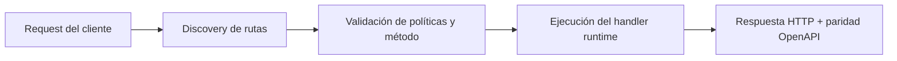

# Playbook estilo FastAPI / Next.js


> Estado verificado al **10 de marzo de 2026**.
> Nota de runtime: FastFN auto-instala dependencias locales por función desde `requirements.txt` / `package.json`; en `fastfn dev --native` necesitas runtimes instalados en host, mientras que `fastfn dev` depende de Docker daemon activo.
## Ficha rapida

- Complejidad: Avanzada
- Tiempo tipico: 45-90 minutos
- Usala cuando: migras APIs estilo FastAPI o Next.js
- Resultado: validas paridad de rutas y politica con checkpoints de rollout


Este playbook es para equipos que migran desde:

- APIs estilo FastAPI
- rutas API estilo Next.js

El foco es operativo: paridad de rutas, paridad de politica, y seguimiento de release.

## Objetivo de migracion

Mover ejecucion a FastFN manteniendo comportamiento externo:

- mismas rutas publicas
- mismos metodos permitidos
- misma politica de auth/hosts
- mismo contrato de respuesta

## Etapa 1: mapear la superficie actual

Antes de tocar codigo, genera un baseline:

1. listar rutas y metodos publicos
2. listar reglas de auth y restriccion por host
3. listar supuestos de request/response

Formato sugerido:

| Ruta | Metodos | Servicio actual | Regla auth | Nota |
|---|---|---|---|---|
| `/users` | `GET` | FastAPI | Bearer | lista usuarios |
| `/users/{id}` | `GET` | FastAPI | Bearer | detalle |
| `/health` | `GET` | Next API route | publica | health |

## Etapa 2: crear estructura de rutas en FastFN

Primero usa ruteo por archivos, luego agrega politica solo donde haga falta.

Layout ejemplo:

```text
functions/
  python/
    users/
      get.py
      [id]/
        get.py
  node/
    health/
      get.js
```

Reglas:

- [Especificacion de funciones](../referencia/especificacion-funciones.md)
- [Arquitectura](../explicacion/arquitectura.md)

## Etapa 3: aplicar politica y rutas explicitas

Usa `fn.config.json` cuando necesites:

- `invoke.routes` explicito
- `invoke.allow_hosts`
- limites de timeout/concurrency/body
- override controlado con `invoke.force-url`

No fuerces override global salvo ventana de cutover.

Referencia:

- [Especificacion de funciones](../referencia/especificacion-funciones.md)
- [Config global (`FN_FORCE_URL`)](../referencia/config-fastfn.md)

## Etapa 4: verificar paridad con checks concretos

Checks base:

```bash
curl -sS 'http://127.0.0.1:8080/_fn/health' | jq
curl -sS 'http://127.0.0.1:8080/_fn/openapi.json' | jq '.paths | keys'
curl -sS 'http://127.0.0.1:8080/_fn/catalog' | jq '{mapped_routes, mapped_route_conflicts}'
```

Suites de integracion:

```bash
bash tests/integration/test-openapi-system.sh
bash tests/integration/test-api.sh
```

Si el release incluye modo native:

```bash
bash tests/integration/test-openapi-native.sh
```

## Etapa 5: documentacion y seguimiento

Por cada grupo de rutas migradas:

- actualizar docs y ejemplos de funciones
- actualizar expectativas OpenAPI en tests
- registrar cambios de comportamiento en notas de rollout

Checklist sugerido:

- [ ] todas las rutas baseline estan mapeadas en FastFN
- [ ] sin `mapped_route_conflicts` inesperados
- [ ] metodos OpenAPI iguales a metodos de politica
- [ ] paridad de auth validada en endpoints representativos
- [ ] suite CI de integracion en verde

## Etapa 6: estrategia de rollout

Patron recomendado:

1. mirror traffic en staging
2. comparar status/body/headers
3. mover trafico por grupos de rutas
4. usar `invoke.force-url` solo en cutover y retirarlo luego

Guias relacionadas:

- [Ejecutar y probar](./ejecutar-y-probar.md)
- [Desplegar a produccion](./desplegar-a-produccion.md)
- [Checklist de seguridad](./checklist-seguridad-produccion.md)

## Diagrama de Flujo



## Prerrequisitos

- CLI de FastFN disponible
- Dependencias por modo verificadas (Docker para `fastfn dev`, OpenResty+runtimes para `fastfn dev --native`)

## Checklist de Validación

- Los comandos de ejemplo devuelven estados esperados
- Las rutas aparecen en OpenAPI cuando aplica
- Las referencias del final son navegables

## Solución de Problemas

- Si un runtime cae, valida dependencias de host y endpoint de health
- Si faltan rutas, vuelve a ejecutar discovery y revisa layout de carpetas

## Ver también

- [Especificación de Funciones](../referencia/especificacion-funciones.md)
- [Referencia API HTTP](../referencia/api-http.md)
- [Checklist Ejecutar y Probar](ejecutar-y-probar.md)
