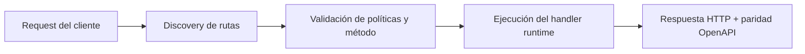

# Telegram AI Digest (cron)


> Estado verificado al **10 de marzo de 2026**.
> Nota de runtime: FastFN auto-instala dependencias locales por función desde `requirements.txt` / `package.json`; en `fastfn dev --native` necesitas runtimes instalados en host, mientras que `fastfn dev` depende de Docker daemon activo.
## Ficha rapida

- Complejidad: Intermedia
- Tiempo tipico: 15-30 minutos
- Usala cuando: quieres programar un digest de Telegram con resumen opcional
- Resultado: quedan listos secretos, schedule y ejecucion


Esta funcion envia un digest periodico a tu chat de Telegram usando fuentes gratuitas (sin keys para clima/noticias) y un resumen opcional con IA.

## Funcion

- Funcion: `telegram-ai-digest`
- Ruta: `/telegram-ai-digest`
- Metodos: `GET`, `POST`
- Schedule: definido por funcion en `<FN_FUNCTIONS_ROOT>/telegram-ai-digest/fn.config.json`

## Configurar secretos

Editar `<FN_FUNCTIONS_ROOT>/telegram-ai-digest/fn.env.json`:

- `TELEGRAM_BOT_TOKEN`
- `TELEGRAM_CHAT_ID`
- `OPENAI_API_KEY`

`OPENAI_API_KEY` es opcional: si falta, se envia el digest sin reescritura IA.

## Cron schedule

El schedule vive en `fn.config.json`:

```json
"schedule": {
  "enabled": true,
  "every_seconds": 60,
  "method": "GET",
  "query": {"dry_run": "false"},
  "context": {"type": "cron"}
}
```

Para desactivar:

```json
"enabled": false
```

## Test manual

Dry run:

```bash
curl -sS 'http://127.0.0.1:8080/telegram-ai-digest?chat_id=1160337817&dry_run=true'
```

Enviar al celular:

```bash
curl -sS 'http://127.0.0.1:8080/telegram-ai-digest?chat_id=1160337817&dry_run=false'
```

Opciones:

- `include_ai=true|false` (default `false`)
- `include_weather=true|false` (default `true`)
- `include_news=true|false` (default `true`)
- `max_items=5` (1–10)
- `min_interval_secs=60` (0–86400). Con `0` envia siempre.

## Que envia

- Clima: Open‑Meteo (sin API key)
- Noticias: Google News RSS (sin API key)
- Ubicacion: por IP del caller (ipapi.co)
- Idioma: inferido por pais (es/en)
 - Formato: HTML (mejor render en Telegram)

## Ejemplo de respuesta

```json
{
  "ok": true,
  "dry_run": false,
  "chat_id": "1160337817",
  "used_ai": true,
  "telegram": {"message_id": 123},
  "preview": "..."
}
```

## Diagrama de Flujo



## Objetivo

Alcance claro, resultado esperado y público al que aplica esta guía.

## Prerrequisitos

- CLI de FastFN disponible
- Dependencias por modo verificadas (Docker para `fastfn dev`, OpenResty+runtimes para `fastfn dev --native`)

## Checklist de Validación

- Los comandos de ejemplo devuelven estados esperados
- Las rutas aparecen en OpenAPI cuando aplica
- Las referencias del final son navegables

## Solución de Problemas

- Si un runtime cae, valida dependencias de host y endpoint de health
- Si faltan rutas, vuelve a ejecutar discovery y revisa layout de carpetas

## Ver también

- [Especificación de Funciones](../referencia/especificacion-funciones.md)
- [Referencia API HTTP](../referencia/api-http.md)
- [Checklist Ejecutar y Probar](ejecutar-y-probar.md)
