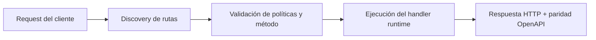

# Telegram E2E (Enviar un Mensaje Real)


> Estado verificado al **10 de marzo de 2026**.
> Nota de runtime: FastFN auto-instala dependencias locales por función desde `requirements.txt` / `package.json`; en `fastfn dev --native` necesitas runtimes instalados en host, mientras que `fastfn dev` depende de Docker daemon activo.
## Ficha rapida

- Complejidad: Intermedia
- Tiempo tipico: 15-25 minutos
- Usala cuando: quieres validar envio real a Telegram end-to-end
- Resultado: token y chat quedan probados con mensaje real


Esta guia verifica un camino real end-to-end:

`fastfn` -> `telegram-send` -> Telegram Bot API -> tu app de Telegram.

!!! warning "Secretos"
    No commitees tokens reales. Guarda secretos en `fn.env.json` y mantenelos fuera del historial de git.

## 1) Crear un bot token

1. Abrí Telegram y hablá con **@BotFather**
2. Creá un bot nuevo y copiá el token (`TELEGRAM_BOT_TOKEN`)

## 2) Configurar el secreto de la funcion (env de fastfn)

Editá el env de la funcion (Console UI):

- Abrí `http://127.0.0.1:8080/console/explorer/node/telegram-send`
- Seteá `TELEGRAM_BOT_TOKEN` en el editor **Env**
- Marcá `is_secret=true` para que la consola no muestre el valor

El archivo en disco es:

`<FN_FUNCTIONS_ROOT>/telegram-send/fn.env.json`

En este repo (corriendo `fastfn dev examples/functions`), ese path es:

`examples/functions/node/telegram-send/fn.env.json`

!!! tip "Consola deshabilitada?"
    La Console UI viene deshabilitada por defecto. Si ejecutas con Docker Compose, habilítala con:

    - `FN_UI_ENABLED=1`
    - mantené `FN_CONSOLE_LOCAL_ONLY=1` (default) para que no se exponga remoto

## 3) Obtener tu `chat_id`

1. Mandale `/start` al bot (o cualquier mensaje)
2. Pedí updates:

```bash
export TELEGRAM_BOT_TOKEN='...'
curl -sS "https://api.telegram.org/bot${TELEGRAM_BOT_TOKEN}/getUpdates"
```

Buscá:

`result[].message.chat.id`

Ese es tu `CHAT_ID`.

## 4) Enviar un mensaje real via fastfn

### Opcion A: curl

```bash
export CHAT_ID='123456789'
curl -sS "http://127.0.0.1:8080/telegram-send?chat_id=${CHAT_ID}&text=Hola&dry_run=false"
```

Esperado: el JSON incluye `"sent":true`.

!!! tip "Usar secretos desde docker-compose/.env"
    El demo `telegram-send` prefiere `fn.env.json`, pero también puede hacer fallback a variables de entorno del proceso:

    - `TELEGRAM_BOT_TOKEN`
    - `TELEGRAM_API_BASE` (opcional)

    Esto sirve si guardas secretos en un `.env` local usado por Docker Compose y no quieres escribirlos en `fn.env.json`.

    Si ejecutas `fastfn` con `docker compose`, `docker-compose.yml` ya pasa estas variables al contenedor.

### Opcion B: script manual (recomendado)

Este script llama fastfn y falla si la respuesta indica `dry_run=true` o `sent!=true`.

```bash
CHAT_ID='123456789' TEXT='hola desde fastfn' ./scripts/manual/telegram-e2e.sh
```

### Opcion C: script solo-docker (cuando el loopback del host esta bloqueado)

```bash
CHAT_ID='123456789' TEXT='hola desde FastFN' ./scripts/manual/telegram-e2e-docker.sh
```

## 5) Opcional: AI reply sin configurar webhook

Podés probar el bot con IA mandando un POST simulando un webhook:

```bash
curl -sS 'http://127.0.0.1:8080/telegram-ai-reply' \
  -X POST \
  -H 'Content-Type: application/json' \
  -d '{"message":{"chat":{"id":'"${CHAT_ID}"'},"text":"Hola"}}'
```

Esto llama a OpenAI y luego responde por Telegram (requiere `OPENAI_API_KEY` y `TELEGRAM_BOT_TOKEN` en `fn.env.json`).

!!! tip "Timeouts"
    `telegram-ai-reply` hace llamadas reales a la red (OpenAI + Telegram). Asegurate de darle mas timeout en `<FN_FUNCTIONS_ROOT>/telegram-ai-reply/fn.config.json`, por ejemplo:

    ```json
    { "timeout_ms": 30000 }
    ```

## Notas

- Los envios reales requieren `TELEGRAM_BOT_TOKEN` y `OPENAI_API_KEY` configurados en `fn.env.json`.

## Limpieza (recomendado)

Después del check E2E, remové secretos del env de la función:

- Consola: dejar el valor vacío (o borrar la key) y guardar.
- O editá `<FN_FUNCTIONS_ROOT>/telegram-send/fn.env.json` y borra la entrada.

## 6) Variante Python (reply con IA)

Este repo incluye una version Python del bot:

- Funcion: `telegram-ai-reply-py`
- Ruta: `/telegram-ai-reply-py`

Ejemplo (webhook POST):

```bash
export CHAT_ID='123456789'
curl -sS 'http://127.0.0.1:8080/telegram-ai-reply-py' \
  -X POST \
  -H 'Content-Type: application/json' \
  -d '{"message":{"chat":{"id":'"${CHAT_ID}"'},"text":"Hola desde python"}}'
```

## Diagrama de Flujo



## Objetivo

Alcance claro, resultado esperado y público al que aplica esta guía.

## Prerrequisitos

- CLI de FastFN disponible
- Dependencias por modo verificadas (Docker para `fastfn dev`, OpenResty+runtimes para `fastfn dev --native`)

## Checklist de Validación

- Los comandos de ejemplo devuelven estados esperados
- Las rutas aparecen en OpenAPI cuando aplica
- Las referencias del final son navegables

## Solución de Problemas

- Si un runtime cae, valida dependencias de host y endpoint de health
- Si faltan rutas, vuelve a ejecutar discovery y revisa layout de carpetas

## Ver también

- [Especificación de Funciones](../referencia/especificacion-funciones.md)
- [Referencia API HTTP](../referencia/api-http.md)
- [Checklist Ejecutar y Probar](ejecutar-y-probar.md)
