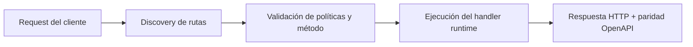

# Enrutamiento Zero-Config (estilo Next.js / rutas dinámicas por archivos)


> Estado verificado al **10 de marzo de 2026**.
> Nota de runtime: FastFN auto-instala dependencias locales por función desde `requirements.txt` / `package.json`; en `fastfn dev --native` necesitas runtimes instalados en host, mientras que `fastfn dev` depende de Docker daemon activo.
## Vista Rápida

- Complejidad: Intermedio
- Tiempo típico: 15-25 minutos
- Úsalo cuando: quieres rutas por filesystem con precedencia predecible
- Resultado: el descubrimiento de rutas y los conflictos son deterministas

FastFN soporta enrutamiento basado en archivos con detección automática de runtime. Puedes publicar endpoints sin escribir `fn.config.json` por función.

## 1. Auto-descubrimiento de Runtime

El runtime se infiere por extensión de archivo:

- `.js`, `.ts` -> `node`
- `.py` -> `python`
- `.php` -> `php`
- `.rs` -> `rust`
- `.go` -> `go`

## 2. Reglas de Rutas Basadas en Archivos

Dado un root de proyecto:

```text
my-project/
  users/
    index.js
    [id].js
  blog/
    [...slug].py
  admin/
    post.users.[id].py
```

Rutas descubiertas:

- `users/index.js` -> `GET /users`
- `users/[id].js` -> `GET /users/:id`
- `blog/[...slug].py` -> `GET /blog/:slug*`
- `admin/post.users.[id].py` -> `POST /admin/users/:id`

!!! info "Profundidad de Anidamiento"
    El descubrimiento zero-config soporta hasta **6 niveles** de anidamiento de directorios.
    Por ejemplo, `api/v1/admin/users/settings/profile/index.py` se mapea a
    `GET /api/v1/admin/users/settings/profile`.
    Los directorios con más de 6 niveles se ignoran silenciosamente.

Convenciones:

- `index`, `handler`, `app`, `main` apuntan a la raíz de la carpeta.
- `[id]` mapea a un segmento dinámico (`:id`).
- `[...slug]` mapea a catch-all (`:slug*`).
- Prefijo opcional de método en nombre de archivo: `get.`, `post.`, `put.`, `patch.`, `delete.`.
- Archivos ignorados: `_*.ext`, `*.test.*`, `*.spec.*`.
- Catch-all opcional `[[...opt]]` mapea tanto `/base` como `/base/:opt*`.
- Prefijos reservados bloqueados: `/_fn`, `/console`.
- `/docs` está disponible para rutas públicas.

Configurar carpetas ignoradas (scanner zero-config):

- Directorios ignorados por defecto: `node_modules`, `vendor`, `__pycache__`, `.fastfn`, `.deps`, `.rust-build`, `target`, `src`.
- Para agregar más de forma global, usa:

```bash
FN_ZERO_CONFIG_IGNORE_DIRS="build,dist,tmp" fastfn dev .
```

- O configúralo en la raíz de funciones con `fn.config.json`:

```json
{
  "zero_config": {
    "ignore_dirs": ["build", "dist", "tmp"]
  }
}
```

### Home por carpeta (`fn.config.json`)

Puedes definir un "home" de carpeta sin crear `index.*`.

Ejemplo:

```text
portal/
  fn.config.json
  get.dashboard.js
```

`portal/fn.config.json`:

```json
{
  "home": {
    "route": "dashboard"
  }
}
```

Resultado:

- `GET /portal/dashboard` -> manejado por `portal/get.dashboard.js`
- `GET /portal` -> mismo handler (alias home de carpeta)

Notas:

- `home.route` puede ser absoluto (`/portal/dashboard`) o relativo (`dashboard`).
- Para alias de carpeta, FastFN resuelve `home.route` contra rutas detectadas en esa misma carpeta.

### Comportamiento de home raíz (`/`)

Por defecto, FastFN mantiene una landing interna en `/`. Puedes overridearla:

```bash
# Dispatch interno (sin 302): ejecuta handler mapeado en /showcase
FN_HOME_FUNCTION=/showcase fastfn dev .

# Redirect (302)
FN_HOME_REDIRECT=/_fn/docs fastfn dev .
```

O desde `fn.config.json` en el root (cuando ese archivo existe en el `FN_FUNCTIONS_ROOT` efectivo):

```json
{
  "home": {
    "route": "/showcase"
  }
}
```

`home` soporta:

- `route` (o `function`): path interno para ejecutar en `/`
- `redirect`: URL/path para redirigir desde `/` (302)

Precedencia (de mayor a menor):

1. `FN_HOME_FUNCTION`
2. `FN_HOME_REDIRECT`
3. `home` en `fn.config.json` raíz
4. landing interna por defecto

## 3. Precedencia (Importante)

FastFN fusiona rutas desde múltiples fuentes:

1. Enrutamiento por archivos (estilo Next.js)
2. `fn.routes.json` (mapa explícito de rutas)
3. `fn.config.json` (política por función)

Comportamiento importante:

- `fn.routes.json` puede sobrescribir rutas basadas en archivos.
- Las rutas de `fn.config.json` **no sobrescriben silenciosamente** una URL ya mapeada por defecto.
  - Usa `invoke.force-url: true` para migrar una función específica.
  - O configura `FN_FORCE_URL=1` (o `fastfn dev --force-url`) para forzar todas las rutas de policy globalmente.
- Si dos rutas colisionan con la misma prioridad, FastFN lo trata como conflicto real y responde `409`.

## 4. Logs de Descubrimiento

Ejecuta:

```bash
fastfn dev .
```

Busca logs `[Discovery]` para verificar runtime, entry file y mapping generado.

`fastfn dev` ahora monta el root completo del proyecto en desarrollo para que hot reload detecte archivos/carpetas nuevas sin reiniciar.

Comportamiento de hot reload:

- `fastfn dev` dispara reload inmediato ante cambios usando `/_fn/reload`.
- `/_fn/reload` acepta `GET` y `POST`.
- OpenResty usa watchdog inotify no bloqueante en Linux por defecto.
- Si watchdog no está disponible, hace fallback a escaneo por intervalo (`FN_HOT_RELOAD_INTERVAL`, default `2s`).
- Variables opcionales de tuning:
  - `FN_HOT_RELOAD_WATCHDOG=0|1`
  - `FN_HOT_RELOAD_WATCHDOG_POLL`
  - `FN_HOT_RELOAD_DEBOUNCE_MS`

!!! note "Manejo de Directorios de Runtime"
    Los directorios con nombre de runtime (`python/`, `node/`, `php/`, `lua/`, `rust/`, `go/`)
    en el nivel raíz son escaneados por el scanner específico de runtime, no por el scanner zero-config.
    Esto previene el doble registro de funciones agrupadas por runtime.

## 5. Comportamiento Multi-Directorio / Multi-App

Cuando ejecutas `fastfn dev <root>`, los prefijos de ruta siguen la estructura de carpetas. Esto te deja correr varias apps desde un mismo root sin colisiones.

Root de ejemplo:

```text
tests/fixtures/
  nextstyle-clean/
    users/index.js
  polyglot-demo/
    fn.routes.json
```

Rutas:

- `nextstyle-clean/users/index.js` -> `GET /nextstyle-clean/users`
- `polyglot-demo/fn.routes.json` route `GET /items` -> `GET /items`

## 6. Endpoints HTML + CSS

Las rutas por archivos también pueden devolver HTML.

Archivos de ejemplo:

- `html/index.js` -> `GET /html`
- `showcase/index.js` -> `GET /showcase`
- `showcase/get.form.js` -> `GET /showcase/form`
- `showcase/post.form.js` -> `POST /showcase/form`
- `showcase/put.form.js` -> `PUT /showcase/form`

Cada handler necesita:

- `status: 200`
- `headers: { "Content-Type": "text/html; charset=utf-8" }`
- `body` con HTML (y opcional CSS inline en `<style>`)

## 7. Enrutamiento por Archivo de Método

Crea archivos handler separados por método HTTP usando el nombre del método como nombre de archivo:

```text
orders/
  get.py       # GET /orders
  post.py      # POST /orders
  [id]/
    get.py     # GET /orders/:id
    put.py     # PUT /orders/:id
    delete.py  # DELETE /orders/:id
```

Cada archivo maneja exactamente un método HTTP, evitando ramificaciones `if method == "POST"`.
FastFN infiere el método del prefijo del nombre de archivo (`get.`, `post.`, `put.`, `patch.`, `delete.`).

Combinado con segmentos dinámicos `[id]`, esto te da una estructura REST API completa
con un archivo por endpoint, similar a cómo Next.js maneja las rutas de API.

## 8. Señales Warm/Cold del Runtime

Las respuestas del gateway incluyen headers de ciclo de vida:

- `X-FastFN-Function-State: cold|warm`
- `X-FastFN-Warmed: true` en la primera respuesta exitosa tras warm-up
- `X-FastFN-Warming: true` con `Retry-After: 1` cuando el primer hit sigue calentando

El build de Rust en primer arranque se puede ajustar con:

- `FN_RUST_BUILD_TIMEOUT_S` (default: `20`)

## 9. Toggles de Docs Internas y API Admin

- Swagger UI interna: `/_fn/docs`
- OpenAPI JSON interna: `/_fn/openapi.json`
- Deshabilitar endpoints de docs internas:
  - `FN_DOCS_ENABLED=0`
- Deshabilitar endpoints admin/console (`/_fn/*` write/admin handlers):
  - `FN_ADMIN_API_ENABLED=0`

Para un racional más profundo y resultados validados, consulta:

- `docs/es/articulos/apis-poliglotas-next-style.md`

## 10. Nombre de operación, summary y IDs OpenAPI

En routing por archivos, el nombre de operación se deriva; no se define por decorador.

Mapeo práctico:

- Nombre de path: se deriva de carpeta/archivo (`users/[id].js` -> `/users/{id}`)
- Método HTTP: se deriva del prefijo (`get.`, `post.`...) o política de métodos permitidos
- Summary: se puede ajustar con `invoke.summary` en `fn.config.json` o hint `@summary`
- `operationId`: se genera como `<method>_<runtime>_<name>_<version>`
- Tags: las genera el gateway (`functions` para rutas públicas)

Ejemplo de summary en `fn.config.json`:

```json
{
  "invoke": {
    "methods": ["GET"],
    "summary": "Obtener perfil de cliente"
  }
}
```

Ejemplo de hint en handler:

```js
// @summary Obtener suscripciones activas
exports.handler = async () => ({ status: 200, body: [] });
```

## 11. Sanity Check de Swagger/OpenAPI

Con `fastfn dev examples/functions/next-style` corriendo:

```bash
curl -sS http://127.0.0.1:8080/_fn/openapi.json | jq '.paths | keys | length'
```

Expectativas rápidas:

- Existen endpoints internos bajo `/_fn/*` (por ejemplo `/_fn/invoke`, `/_fn/catalog`).
- Existen rutas públicas como paths OpenAPI mapeados (`/users`, `/users/{id}`, `/blog/{slug}`, `/php/profile/{id}`, `/rust/health`).
- No se emiten operation summaries `unknown/unknown`.

## Diagrama de Flujo



## Objetivo

Alcance claro, resultado esperado y público al que aplica esta guía.

## Prerrequisitos

- CLI de FastFN disponible
- Dependencias por modo verificadas (Docker para `fastfn dev`, OpenResty+runtimes para `fastfn dev --native`)

## Checklist de Validación

- Los comandos de ejemplo devuelven estados esperados
- Las rutas aparecen en OpenAPI cuando aplica
- Las referencias del final son navegables

## Solución de Problemas

- Si un runtime cae, valida dependencias de host y endpoint de health
- Si faltan rutas, vuelve a ejecutar discovery y revisa layout de carpetas

## Ver también

- [Especificación de Funciones](../referencia/especificacion-funciones.md)
- [Referencia API HTTP](../referencia/api-http.md)
- [Checklist Ejecutar y Probar](ejecutar-y-probar.md)
