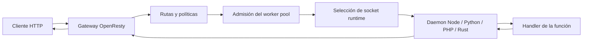

# Arquitectura

> Estado verificado al **13 de marzo de 2026**.
> Nota de runtime: FastFN resuelve dependencias y build por función según el runtime: Python usa `requirements.txt`, Node usa `package.json`, PHP instala desde `composer.json` cuando existe, y Rust compila handlers con `cargo`. En `fastfn dev --native` necesitas runtimes y herramientas del host, mientras que `fastfn dev` depende de un daemon de Docker activo.

## Vista rápida

- Complejidad: Avanzada
- Tiempo típico: 20-35 minutos
- Úsala cuando: quieres entender dónde ocurren el ruteo, la cola, la selección de sockets y la ejecución del runtime
- Resultado: un modelo práctico para depurar salud, escalado y flujo de requests

## Objetivos de diseño

FastFN mantiene la plataforma simple de tres maneras:

1. un solo edge HTTP
2. discovery guiado por filesystem
3. control por función sin una capa grande de control central

Por eso OpenResty queda en el borde y los runtimes de lenguaje viven detrás de Unix sockets.

## Modelo mental

En modo Docker, la misma pila corre dentro del servicio `openresty`. En modo native, el CLI arranca OpenResty y los daemons directamente en el host.

## Discovery y mapa de rutas

FastFN no usa un `routes.json` estático como fuente de verdad. Descubre funciones desde un directorio y arma el mapa de rutas en runtime.

Formas comunes de definir el directorio de funciones:

- `fastfn dev functions`
- `fastfn.json` -> `"functions-dir": "functions"`
- `FN_FUNCTIONS_ROOT=/ruta/absoluta/a/functions`

El orden de runtimes también se puede configurar:

- `FN_RUNTIMES=python,node,php,rust`

Si la misma ruta pública existe en más de un runtime, gana el primer runtime habilitado, salvo que fuerces el takeover de forma explícita.

## Ruteo hacia runtimes

FastFN separa los runtimes en dos grupos:

- `lua` corre dentro de OpenResty.
- `node`, `python`, `php`, `rust` y `go` corren detrás de Unix sockets.

Cuando un runtime tiene un solo daemon, el gateway usa un socket. Cuando tiene varios daemons, el gateway mantiene una lista y elige un socket sano con `round_robin`.

Controles principales:

- `runtime-daemons` o `FN_RUNTIME_DAEMONS` para definir counts
- `FN_RUNTIME_SOCKETS` para pasar un mapa explícito de sockets
- `FN_SOCKET_BASE_DIR` para la ubicación base de sockets generados

Reglas importantes:

- `FN_RUNTIME_SOCKETS` gana sobre los counts generados.
- `lua` ignora counts porque no corre como daemon externo.
- La salud se sigue por socket, no solo por runtime.
- `/_fn/health` expone tanto la salud agregada como la lista de sockets.

## Controles de concurrencia: qué hace cada uno

FastFN tiene dos capas distintas de escalado y sirven para cosas diferentes.

| Control | Alcance | Dónde aplica | Qué hace |
| --- | --- | --- | --- |
| `runtime-daemons` | global por runtime | arranque | agrega más procesos y sockets para un runtime |
| `worker_pool.*` | por función | admisión y cola en gateway | limita ejecuciones activas y cola antes de llamar al runtime |
| internals del runtime | específico del runtime | dentro de cada daemon | workers hijos, reutilización de procesos, builds e instalaciones |

Lectura práctica:

- Usa `runtime-daemons` cuando quieres más destinos reales para ese runtime.
- Usa `worker_pool` cuando quieres backpressure y control de cola por función.
- Mide ambos con tráfico real; se complementan, no se reemplazan.

## Elección de binarios

En modo native, FastFN puede elegir el ejecutable usado para cada runtime o herramienta mediante `runtime-binaries` o variables `FN_*_BIN`.

Ejemplos:

- `FN_PYTHON_BIN`
- `FN_NODE_BIN`
- `FN_PHP_BIN`
- `FN_CARGO_BIN`
- `FN_COMPOSER_BIN`
- `FN_OPENRESTY_BIN`

Detalle importante:

- FastFN elige un ejecutable por clave.
- Si corres tres daemons de Python, los tres usan el mismo `FN_PYTHON_BIN`.
- El routing multi-daemon no es un pool mixto de versiones.

## Salud, failover y errores

El arranque y el flujo de requests están pensados para fallar de forma clara:

- El modo native verifica que el puerto del host esté libre antes de iniciar.
- Las rutas de socket se revisan antes del arranque y se eliminan sockets viejos.
- Los health checks corren por runtime y por socket.
- Si un socket cae, el gateway puede saltarlo y seguir usando los sanos.
- Si todos los sockets de un runtime están caídos, las requests fallan con `503 runtime unavailable`.

Cuando `include_debug_headers=true`, las respuestas de función pueden incluir:

- `X-Fn-Runtime-Routing`
- `X-Fn-Runtime-Socket-Index`

Sirven para comprobar que el tráfico realmente rota entre sockets.

## Tradeoffs

Este modelo es simple a propósito, pero no hace milagros:

- Más daemons pueden ayudar en runtimes bloqueados o CPU-bound, pero también pueden agregar overhead.
- La cola en el gateway mejora el control, no la velocidad bruta por sí sola.
- Unix sockets vuelven la pila local más predecible, pero siguen agregando un salto frente a Lua in-process.

Por eso FastFN publica artefactos crudos de benchmark y conviene medir tu propia carga antes de subir counts en todos los runtimes.

## Enlaces relacionados

- [Especificación de funciones](../referencia/especificacion-funciones.md)
- [Configuración global](../referencia/config-fastfn.md)
- [Referencia API HTTP](../referencia/api-http.md)
- [Escalar daemons de runtime](../como-hacer/escalar-daemons-runtime.md)
- [Ejecutar y probar](../como-hacer/ejecutar-y-probar.md)
- [Benchmarks de rendimiento](./benchmarks-rendimiento.md)
