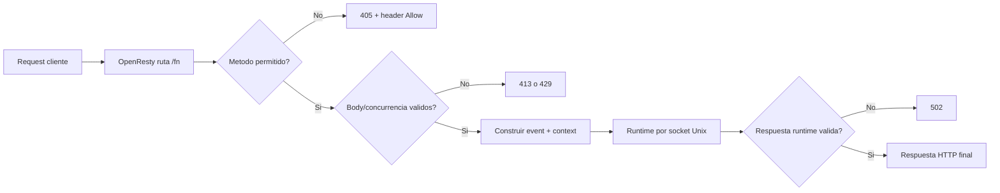
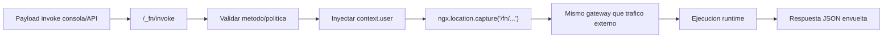
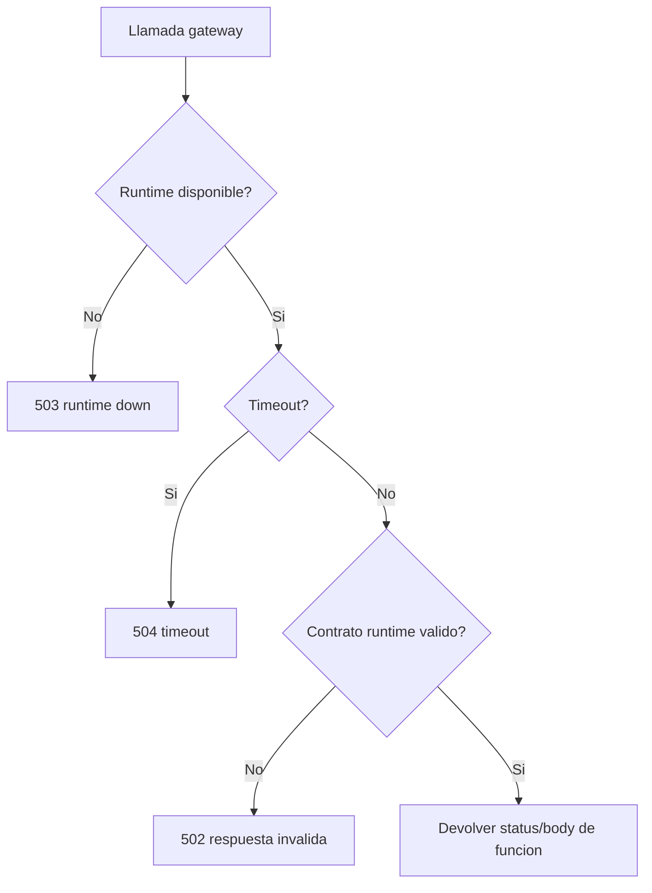

# Flujos visuales

## Flujo de invocacion publica

```mermaid
flowchart LR
  A["Request cliente"] --> B["OpenResty ruta /fn"]
  B --> C{"Metodo permitido?"}
  C -- "No" --> D["405 + header Allow"]
  C -- "Si" --> E{"Body/concurrencia validos?"}
  E -- "No" --> F["413 o 429"]
  E -- "Si" --> G["Construir event + context"]
  G --> H["Runtime por socket Unix"]
  H --> I{"Respuesta runtime valida?"}
  I -- "No" --> J["502"]
  I -- "Si" --> K["Respuesta HTTP final"]
```

## Flujo interno (`/_fn/invoke`)

```mermaid
flowchart LR
  A["Payload invoke consola/API"] --> B["/_fn/invoke"]
  B --> C["Validar metodo/politica"]
  C --> D["Inyectar context.user"]
  D --> E["ngx.location.capture('/fn/...')"]
  E --> F["Mismo gateway que trafico externo"]
  F --> G["Ejecucion runtime"]
  G --> H["Respuesta JSON envuelta"]
```

## Mapeo de errores

```mermaid
flowchart TD
  A["Llamada gateway"] --> B{"Runtime disponible?"}
  B -- "No" --> C["503 runtime down"]
  B -- "Si" --> D{"Timeout?"}
  D -- "Si" --> E["504 timeout"]
  D -- "No" --> F{"Contrato runtime valido?"}
  F -- "No" --> G["502 respuesta invalida"]
  F -- "Si" --> H["Devolver status/body de funcion"]
```
