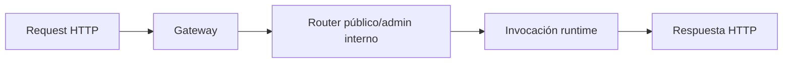

# Referencia HTTP


> Estado verificado al **10 de marzo de 2026**.
> Nota de runtime: FastFN auto-instala dependencias locales por función desde `requirements.txt` / `package.json`; en `fastfn dev --native` necesitas runtimes instalados en host, mientras que `fastfn dev` depende de Docker daemon activo.
Referencia formal de endpoints publicos e internos.

## Convenciones

- Base URL local: `http://127.0.0.1:8080`
- Formato de error comun:

```json
{"error":"message"}
```

## Endpoints publicos

FastFN sirve funciones en rutas normales como `/hello` y `/users/123`.

Estas rutas son las que ves en:

- `GET /openapi.json`
- `GET /docs` (Swagger UI)

### `GET|POST|PUT|PATCH|DELETE /<ruta>`

Invoca la funcion mapeada detras de esa ruta.

Las rutas se generan desde:

- file routes (estilo Next.js),
- `fn.routes.json`,
- o `fn.config.json -> invoke.routes`.

### Ejemplo GET

```bash
curl -sS 'http://127.0.0.1:8080/hello?name=World'
```

### Ejemplo POST

```bash
curl -sS -X POST 'http://127.0.0.1:8080/risk-score?email=user@example.com' \
  -H 'Content-Type: application/json' \
  -d '{"source":"web"}'
```

## Versionado (opcional)

FastFN soporta versiones lado-a-lado dentro de la carpeta de una función (por ejemplo `v2/`).

### `GET|POST|PUT|PATCH|DELETE /<name>@<version>`

Invoca una versión específica por nombre.

Regla clave (aplica a todas):

- Los metodos permitidos salen de `fn.config.json -> invoke.methods`.
- Si el metodo no esta permitido: `405` + header `Allow`.

### Rutas custom via `invoke.routes`

Endpoints mapeados opcionales por funcion desde `fn.config.json`:

```json
{
  "invoke": {
    "methods": ["GET"],
    "routes": ["/api/node-echo"]
  }
}
```

Despues de recargar/discovery, llamar `/api/node-echo` invoca esa funcion.

## Endpoints internos de plataforma (`/_fn/*`)

### Salud y discovery

- `GET /_fn/health`
- `POST /_fn/reload`
- `GET /_fn/catalog`
- `GET /_fn/packs`
- `GET /_fn/schedules`
- `GET /_fn/jobs`
- `POST /_fn/jobs`
- `GET /_fn/jobs/<id>`
- `DELETE /_fn/jobs/<id>`
- `GET /_fn/jobs/<id>/result`

### CRUD y configuracion

- `GET|POST|DELETE /_fn/function`
- `GET|PUT /_fn/function-config`
- `GET|PUT /_fn/function-env`
- `PUT /_fn/function-code`

### Operacion de consola

- `POST /_fn/invoke`
- `POST /_fn/login`
- `POST /_fn/logout`
- `GET|POST|PUT|PATCH|DELETE /_fn/ui-state`

Reglas de `/_fn/ui-state`:

- `GET` requiere acceso a Console API.
- `POST|PUT|PATCH|DELETE` requieren acceso a Console API **y** permiso de escritura (`FN_CONSOLE_WRITE_ENABLED=1` o token admin).

`/_fn/function-config` PUT acepta campos de rutas y metodos tanto a nivel raiz como anidados:

```json
{
  "timeout_ms": 5000,
  "methods": ["GET", "POST"],
  "routes": ["/alice/demo", "/alice/demo/{id}"]
}
```

Equivalente a la forma anidada:

```json
{
  "timeout_ms": 5000,
  "invoke": {
    "methods": ["GET", "POST"],
    "routes": ["/alice/demo", "/alice/demo/{id}"]
  }
}
```

Cuando ambos estan presentes, `invoke.*` tiene precedencia.

El payload de `/_fn/function-env` acepta:

- valores escalares: `"KEY":"value"`
- objetos secretos: `"KEY":{"value":"secret","is_secret":true}`
- `null` para eliminar una clave

`GET /_fn/function` tambien devuelve metadata de resolucion de dependencias:

- `metadata.dependency_resolution.mode` (`manifest` o `inferred`)
- `metadata.dependency_resolution.manifest_generated`
- `metadata.dependency_resolution.inferred_imports`
- `metadata.dependency_resolution.resolved_packages`
- `metadata.dependency_resolution.unresolved_imports`
- `metadata.dependency_resolution.last_install_status` / `last_error`

## `/_fn/invoke` (payload completo)

```bash
curl -sS 'http://127.0.0.1:8080/_fn/invoke' \
  -X POST \
  -H 'Content-Type: application/json' \
  --data '{
    "runtime":"node",
    "name":"node-echo",
    "version":null,
    "method":"POST",
    "query":{"name":"Node"},
    "body":"{\"x\":1}",
    "context":{"trace_id":"abc-123"}
  }'
```

Campos:

- `runtime` opcional cuando nombre no es ambiguo
  - valores soportados: `python`, `node`, `php`, `rust`
- `name` obligatorio
- `version` opcional (`null` para default)
- `method` obligatorio
- `query` objeto opcional
- `body` string o JSON serializable
- `context` objeto opcional inyectado a `event.context.user`

## OpenAPI y Swagger

- `GET /openapi.json`
- `GET /docs`

OpenAPI es dinamico y refleja metodos permitidos por funcion/version en tiempo real.

## Tabla de errores

| Codigo | Significado | Caso tipico |
|---|---|---|
| `404` | funcion/version no encontrada | nombre o version inexistente |
| `405` | metodo no permitido | `POST` a funcion solo `GET` |
| `409` | ambiguedad de ruta | mismo nombre en runtimes distintos o misma ruta mapeada en multiples funciones |
| `413` | payload demasiado grande | body > `max_body_bytes` |
| `429` | concurrencia excedida | supera `max_concurrency` |
| `502` | respuesta runtime invalida | contrato runtime roto |
| `503` | runtime caido | socket no disponible |
| `504` | timeout | funcion excede `timeout_ms` |
| `500` | error interno | excepcion gateway |

## Diagrama de Ciclo HTTP



## Contrato

Define la forma esperada de request/response, campos de configuración y garantías de comportamiento.

## Ejemplo End-to-End

Usa los ejemplos de esta página como plantillas canónicas para implementación y testing.

## Casos Límite

- Fallbacks ante configuración faltante
- Conflictos de rutas y precedencia
- Matices por runtime

## Ver también

- [Especificación de Funciones](especificacion-funciones.md)
- [Checklist Ejecutar y Probar](../como-hacer/ejecutar-y-probar.md)
- [Arquitectura](../explicacion/arquitectura.md)
