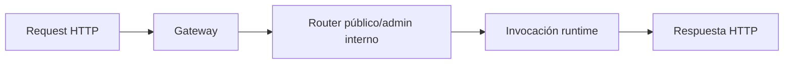

# Referencia HTTP


> Estado verificado al **13 de marzo de 2026**.
> Nota de runtime: FastFN resuelve dependencias y build por función según el runtime: Python usa `requirements.txt`, Node usa `package.json`, PHP instala desde `composer.json` cuando existe, y Rust compila handlers con `cargo`. En `fastfn dev --native` necesitas runtimes y herramientas del host; `fastfn dev` depende de un daemon de Docker activo.
Referencia formal de endpoints publicos e internos.

## Vista rápida

- Complejidad: Referencia
- Tiempo típico: 15-30 minutos
- Úsala cuando: necesitas contrato exacto de endpoints y comportamiento por código de estado
- Resultado: llamadas reproducibles para rutas públicas y operaciones `/_fn/*`

## Convenciones

- Base URL local: `http://127.0.0.1:8080`
- Formato de error comun:

```json
{"error":"message"}
```

## Endpoints publicos

FastFN sirve funciones en rutas normales como `/hello` y `/users/123`.

Estas rutas son las que ves en:

- `GET /openapi.json`
- `GET /docs` (Swagger UI)

### `GET|POST|PUT|PATCH|DELETE /<ruta>`

Invoca la funcion mapeada detras de esa ruta.

Las rutas se generan desde:

- file routes (estilo Next.js),
- `fn.routes.json`,
- o `fn.config.json -> invoke.routes`.

### Ejemplo GET

```bash
curl -sS 'http://127.0.0.1:8080/hello?name=World'
```

### Ejemplo POST

```bash
curl -sS -X POST 'http://127.0.0.1:8080/risk-score?email=user@example.com' \
  -H 'Content-Type: application/json' \
  -d '{"source":"web"}'
```

## Versionado (opcional)

FastFN soporta versiones lado-a-lado dentro de la carpeta de una función (por ejemplo `v2/`).

### `GET|POST|PUT|PATCH|DELETE /<name>@<version>`

Invoca una versión específica por nombre.

Regla clave (aplica a todas):

- Los metodos permitidos salen de `fn.config.json -> invoke.methods`.
- Si el metodo no esta permitido: `405` + header `Allow`.

### Rutas custom via `invoke.routes`

Por defecto, una función en `functions/mi-func/handler.py` es accesible en `/mi-func`. Con `invoke.routes` puedes exponerla en una o más URLs públicas personalizadas — útil para APIs REST, rutas vanity, o montar una función en un prefijo específico.

```json
{
  "invoke": {
    "methods": ["GET"],
    "routes": ["/api/node-echo"]
  }
}
```

- `routes` es un array de rutas URL. Cada ruta se convierte en un endpoint público que invoca esta función.
- Se soportan rutas wildcard: `"/api/v1/*"` matchea `/api/v1/cualquier/cosa`.
- `methods` restringe qué métodos HTTP están permitidos (default: todos).
- Después del discovery (inicio o hot-reload), el gateway registra estas rutas automáticamente.
- Si otra función ya mapea la misma ruta, la petición es rechazada a menos que `invoke.force-url` sea `true`.

### Debug headers (opt-in)

Cuando una función habilita debug headers, la respuesta puede incluir:

- `X-Fn-Runtime`
- `X-Fn-Runtime-Routing`
- `X-Fn-Runtime-Socket-Index`
- `X-Fn-Worker-Pool-Max-Workers`
- `X-Fn-Worker-Pool-Max-Queue`

Sirven para confirmar qué runtime manejó la request y si el tráfico está rotando entre varios sockets.

## Configuración de operaciones (equivalencias en FastFN)

FastFN no usa objetos de operación por decoradores como FastAPI. La configuración vive entre rutas por archivo y `fn.config.json`.

| Concepto estilo FastAPI | Equivalente en FastFN | Notas |
|---|---|---|
| método/path de operación | nombre de archivo + carpeta | la fuente de verdad es filesystem o `fn.routes.json` |
| métodos permitidos | `invoke.methods` | gateway aplica regla y devuelve `405` + `Allow` |
| summary | `invoke.summary` o hint `@summary` | se refleja en OpenAPI |
| ejemplos query/body | `invoke.query`, `invoke.body`, `invoke.content_type` | usados en ejemplos de request OpenAPI |
| operationId | generado automáticamente | formato: `<method>_<runtime>_<name>_<version>` |
| tags | generadas (`functions` / `internal`) | sin mapeo custom por ruta por ahora |

Nota no-1:1: si necesitas customización OpenAPI profunda por operación, usa FastFN como router runtime y aplica transformaciones de schema en tu pipeline de entrega.

## Endpoints internos de plataforma (`/_fn/*`)

### Salud y discovery

- `GET /_fn/health`
- `POST /_fn/reload`
- `GET /_fn/catalog`
- `GET /_fn/packs`
- `GET /_fn/schedules`
- `GET /_fn/jobs`
- `POST /_fn/jobs`
- `GET /_fn/jobs/<id>`
- `DELETE /_fn/jobs/<id>`
- `GET /_fn/jobs/<id>/result`

#### `GET /_fn/health`

Devuelve un snapshot del estado actual de runtimes y rutas.

Ejemplo:

```bash
curl -sS http://127.0.0.1:8080/_fn/health | jq '.runtimes'
```

Forma simplificada:

```json
{
  "python": {
    "routing": "round_robin",
    "health": { "up": true, "reason": "ok" },
    "sockets": [
      { "index": 1, "uri": "unix:/tmp/fastfn/fn-python-1.sock", "up": true, "reason": "ok" },
      { "index": 2, "uri": "unix:/tmp/fastfn/fn-python-2.sock", "up": true, "reason": "ok" }
    ]
  }
}
```

Sirve para confirmar:

- runtimes habilitados
- modo de routing (`single` o `round_robin`)
- salud por socket
- cantidad de conflictos de rutas y resumen de estado de funciones

### CRUD y configuracion

- `GET|POST|DELETE /_fn/function`
- `GET|PUT /_fn/function-config`
- `GET|PUT /_fn/function-env`
- `PUT /_fn/function-code`

### Operacion de consola

- `POST /_fn/invoke`
- `POST /_fn/login`
- `POST /_fn/logout`
- `GET|POST|PUT|PATCH|DELETE /_fn/ui-state`

Reglas de `/_fn/ui-state`:

- `GET` requiere acceso a Console API.
- `POST|PUT|PATCH|DELETE` requieren acceso a Console API **y** permiso de escritura (`FN_CONSOLE_WRITE_ENABLED=1` o token admin).

`/_fn/function-config` PUT acepta campos de rutas y metodos tanto a nivel raiz como anidados:

```json
{
  "timeout_ms": 5000,
  "methods": ["GET", "POST"],
  "routes": ["/alice/demo", "/alice/demo/{id}"]
}
```

Equivalente a la forma anidada:

```json
{
  "timeout_ms": 5000,
  "invoke": {
    "methods": ["GET", "POST"],
    "routes": ["/alice/demo", "/alice/demo/{id}"]
  }
}
```

Cuando ambos estan presentes, `invoke.*` tiene precedencia.

El payload de `/_fn/function-env` acepta:

- valores escalares: `"KEY":"value"`
- objetos secretos: `"KEY":{"value":"secret","is_secret":true}`
- `null` para eliminar una clave

`GET /_fn/function` tambien puede devolver metadata de resolucion de dependencias cuando el runtime la emite (hoy sobre todo Python/Node):

- `metadata.dependency_resolution.mode` (`manifest` o `inferred`)
- `metadata.dependency_resolution.manifest_generated`
- `metadata.dependency_resolution.infer_backend`
- `metadata.dependency_resolution.inference_duration_ms`
- `metadata.dependency_resolution.inferred_imports`
- `metadata.dependency_resolution.resolved_packages`
- `metadata.dependency_resolution.unresolved_imports`
- `metadata.dependency_resolution.last_install_status` / `last_error`

## `/_fn/invoke` (payload completo)

```bash
curl -sS 'http://127.0.0.1:8080/_fn/invoke' \
  -X POST \
  -H 'Content-Type: application/json' \
  --data '{
    "runtime":"node",
    "name":"node-echo",
    "version":null,
    "method":"POST",
    "query":{"name":"Node"},
    "body":"{\"x\":1}",
    "context":{"trace_id":"abc-123"}
  }'
```

Campos:

- `runtime` opcional cuando nombre no es ambiguo
  - valores soportados: `python`, `node`, `php`, `rust`
- `name` obligatorio
- `version` opcional (`null` para default)
- `method` obligatorio
- `query` objeto opcional
- `body` string o JSON serializable
- `context` objeto opcional inyectado a `event.context.user`

## OpenAPI y Swagger

- `GET /openapi.json`
- `GET /docs`

OpenAPI es dinamico y refleja metodos permitidos por funcion/version en tiempo real.

## Casos límite de serialización y encoding

FastFN normaliza salida de runtime a HTTP, pero el comportamiento de serialización depende del tipo de `body` y headers.

| Body devuelto por runtime | Estrategia de headers | Resultado en cliente |
|---|---|---|
| objeto/array | sin `Content-Type` explícito | serialización JSON con `application/json` |
| string | sin `Content-Type` explícito | salida como texto plano |
| string con JSON | `application/json` | se envía como texto; cliente parsea si necesita |
| string binario/base64 | content type explícito + decode en handler | patrón seguro para binarios |

Patrón recomendado para comportamiento determinista:

```json
{
  "status": 200,
  "headers": { "Content-Type": "application/json; charset=utf-8" },
  "body": { "ok": true }
}
```

## Tabla de errores

| Codigo | Significado | Caso tipico |
|---|---|---|
| `404` | funcion/version no encontrada | nombre o version inexistente |
| `405` | metodo no permitido | `POST` a funcion solo `GET` |
| `409` | ambiguedad de ruta | mismo nombre en runtimes distintos o misma ruta mapeada en multiples funciones |
| `413` | payload demasiado grande | body > `max_body_bytes` |
| `429` | concurrencia excedida | supera `max_concurrency` |
| `502` | respuesta runtime invalida | contrato runtime roto |
| `503` | runtime caido | socket no disponible |
| `504` | timeout | funcion excede `timeout_ms` |
| `500` | error interno | excepcion gateway |

## Diagrama de Ciclo HTTP



## Contrato

Define la forma esperada de request/response, campos de configuración y garantías de comportamiento.

## Ejemplo End-to-End

Usa los ejemplos de esta página como plantillas canónicas para implementación y testing.

## Casos Límite

- Fallbacks ante configuración faltante
- Conflictos de rutas y precedencia
- Matices por runtime

## Ver también

- [Especificación de Funciones](especificacion-funciones.md)
- [Checklist Ejecutar y Probar](../como-hacer/ejecutar-y-probar.md)
- [Arquitectura](../explicacion/arquitectura.md)

## Extender OpenAPI: puntos y limites

Puntos de extension:

- metadata de ruta inferida por file routing + archivos por metodo
- ejemplos explicitos en docs alineados al runtime real
- agrupacion por tags/operaciones via convenciones de nombres

Limites:

- OpenAPI debe reflejar comportamiento real; no documentar estados que handlers no devuelven.
- La generacion avanzada de schemas cambia segun runtime.

Comando de validacion:

```bash
curl -sS 'http://127.0.0.1:8080/openapi.json' | jq '.paths | keys'
```

## Validación

Ejecuta este smoke sequence:

```bash
curl -i -sS 'http://127.0.0.1:8080/_fn/health'
curl -sS 'http://127.0.0.1:8080/_fn/catalog' | jq '{mapped_routes, mapped_route_conflicts}'
curl -sS 'http://127.0.0.1:8080/openapi.json' | jq '.paths | keys | length'
```

Esperado:

- health responde `200`
- catálogo devuelve rutas y conflictos de forma determinística
- OpenAPI tiene paths > 0 para proyectos con rutas públicas

## Troubleshooting

- Si `/_fn/*` responde `401/403`, revisa token admin y flags de acceso a consola.
- Si OpenAPI sale vacío, verifica que exista al menos una ruta pública discoverable.
- Si una ruta devuelve `405`, valida `invoke.methods` en `fn.config.json`.
- Si una ruta devuelve `503`, revisa salud de sockets/runtime en `/_fn/health`.

## Siguiente paso
Continúa con [Ejecutar y probar](../como-hacer/ejecutar-y-probar.md) para validar este contrato de punta a punta en local/CI.

## Enlaces relacionados
- [Ejecutar y probar](../como-hacer/ejecutar-y-probar.md)
- [Zero-config routing](../como-hacer/zero-config-routing.md)
- [Plomería runtime/plataforma](../como-hacer/plomeria-runtime-plataforma.md)
- [Especificación de funciones](./especificacion-funciones.md)
- [Contrato runtime](./contrato-runtime.md)
- [Funciones de ejemplo](./funciones-ejemplo.md)
- [Arquitectura](../explicacion/arquitectura.md)
- [Obtener ayuda](../como-hacer/obtener-ayuda.md)
