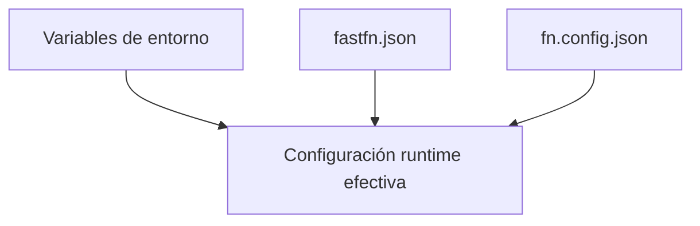

# Referencia de `fastfn.json`


> Estado verificado al **10 de marzo de 2026**.
> Nota de runtime: FastFN auto-instala dependencias locales por función desde `requirements.txt` / `package.json`; en `fastfn dev --native` necesitas runtimes instalados en host, mientras que `fastfn dev` depende de Docker daemon activo.
`fastfn.json` es el archivo de configuración por defecto del CLI.

FastFN lo busca en el directorio actual cuando ejecutas comandos como `fastfn dev` o `fastfn run`.

## Claves Soportadas

| Clave | Tipo | Descripción |
| --- | --- | --- |
| `functions-dir` | `string` | Root default de funciones cuando no pasas directorio al CLI. |
| `public-base-url` | `string` | Base URL publica canonica para `servers[0].url` en OpenAPI. |
| `openapi-include-internal` | `boolean` | Controla si endpoints internos/admin (`/_fn/*`) se muestran en OpenAPI/Swagger. No deshabilita esos endpoints. Default `false`. |
| `force-url` | `boolean` | Opt-in global para permitir que rutas config/policy sobrescriban una URL ya mapeada. Default `false`. Preferi `invoke.force-url` por funcion. |
| `domains` | `array` | Dominios usados por `fastfn doctor domains` para diagnostico DNS/TLS/HTTP. |

Notas:
- La forma recomendada es kebab-case: `functions-dir`, `public-base-url`.
- Alias de compatibilidad que siguen funcionando: `functions_dir`, `functionsDir`, `public_base_url`, `publicBaseUrl`.
- También se aceptan alias para OpenAPI interna: `openapi_include_internal`, `openapi.include_internal`, `swagger-include-admin`.
- `domains` es solo para checks de `fastfn doctor domains`. No aplica restriccion de host entrante por si solo.
- Para restringir hosts entrantes por funcion, usa `invoke.allow_hosts` en cada `fn.config.json`.
- También puedes optar globalmente vía `force-url` o el flag `--force-url` (riesgoso; úsalo con cuidado).

## Ejemplo 1: Directorio Default en Desarrollo

`fastfn.json`

```json
{
  "functions-dir": "examples/functions/next-style"
}
```

Ejecutar:

```bash
fastfn dev
```

Comportamiento esperado:
- FastFN usa `examples/functions/next-style` automaticamente.

## Ejemplo 2: Native para Produccion con Dominio Publico

`fastfn.json`

```json
{
  "functions-dir": "functions",
  "public-base-url": "https://api.midominio.com"
}
```

Ejecutar:

```bash
FN_HOST_PORT=8080 fastfn run --native
```

Validar URL de OpenAPI:

```bash
curl -sS http://127.0.0.1:8080/_fn/openapi.json | jq -r '.servers[0].url'
# https://api.midominio.com
```

## Ejemplo 3: Dominio desde Headers de Reverse Proxy

Si no defines `public-base-url`, FastFN calcula la URL de OpenAPI con:
- `X-Forwarded-Proto`
- `X-Forwarded-Host`
- fallback: `Host` del request

Prueba:

```bash
curl -sS \
  -H 'X-Forwarded-Proto: https' \
  -H 'X-Forwarded-Host: api.proxy.midominio.com' \
  http://127.0.0.1:8080/_fn/openapi.json | jq -r '.servers[0].url'
# https://api.proxy.midominio.com
```

## Ejemplo 4: Bloque de Dominios para Doctor

`fastfn.json`

```json
{
  "domains": [
    "api.midominio.com",
    {
      "domain": "www.midominio.com",
      "expected-target": "lb.midominio.net",
      "enforce-https": true
    }
  ]
}
```

Ejecutar:

```bash
fastfn doctor domains
fastfn doctor domains --json
```

Cada entrada en `domains` soporta:
- forma string: `"api.midominio.com"`
- forma objeto:
  - `domain` (obligatorio)
  - `expected-target` (opcional, IP o CNAME)
  - `enforce-https` (opcional, default `true`)

## Ejemplo 5: Mostrar Endpoints Internos/Admin en Swagger (Sin Apagar APIs)

`fastfn.json`

```json
{
  "functions-dir": "examples/functions/next-style",
  "openapi-include-internal": true
}
```

Ejecutar:

```bash
fastfn dev
```

Validar:

```bash
curl -sS http://127.0.0.1:8080/_fn/openapi.json | jq '.paths | has("/_fn/health")'
# true
```

Para ocultar endpoints internos/admin otra vez en Swagger, ponelo en `false` (o elimina la clave).

## Prioridad

1. Flag `--config` del CLI (ruta explicita).
2. `fastfn.json` en el directorio actual.
3. `fastfn.toml` (solo fallback).

Para resolver URL de OpenAPI:
1. Env `FN_PUBLIC_BASE_URL` (o `public-base-url` desde `fastfn.json`).
2. `X-Forwarded-Proto` + `X-Forwarded-Host`.
3. Scheme + `Host` del request.

## Nota de Seguridad

FastFN bloquea acceso HTTP directo a archivos de config locales:
- `/fastfn.json` responde `404`.
- `/fastfn.toml` responde `404`.

## Diagrama de Precedencia de Configuración



## Contrato

Define la forma esperada de request/response, campos de configuración y garantías de comportamiento.

## Ejemplo End-to-End

Usa los ejemplos de esta página como plantillas canónicas para implementación y testing.

## Casos Límite

- Fallbacks ante configuración faltante
- Conflictos de rutas y precedencia
- Matices por runtime

## Ver también

- [Especificación de Funciones](especificacion-funciones.md)
- [Referencia API HTTP](api-http.md)
- [Checklist Ejecutar y Probar](../como-hacer/ejecutar-y-probar.md)
