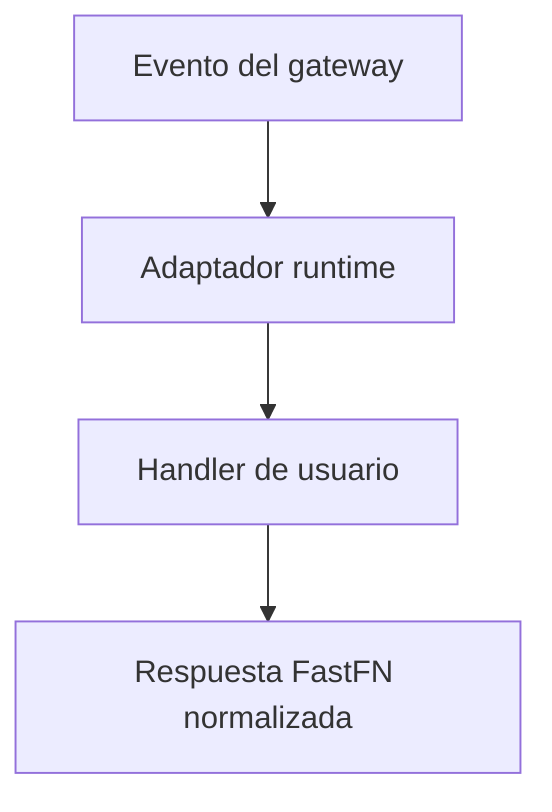

# Contrato runtime (event/context)


> Estado verificado al **10 de marzo de 2026**.
> Nota de runtime: FastFN resuelve dependencias y build por función según el runtime: Python usa `requirements.txt`, Node usa `package.json`, PHP instala desde `composer.json` cuando existe, y Rust compila handlers con `cargo`. En `fastfn dev --native` necesitas runtimes y herramientas del host; `fastfn dev` depende de un daemon de Docker activo.
Este documento define exactamente que envia OpenResty al handler y que debe devolver el runtime.

## 1) Transporte interno

- Protocolo: socket Unix por runtime (`python`, `node`, `php`, `rust`).
- Framing: `4-byte big-endian length + JSON`.
- Request interno: `{ fn, version, event }`.
- Response interno: `{ status, headers, body }` o binario base64.

## 2) Que envia el cliente HTTP y como llega al handler

### Request publico (cliente -> gateway)

```bash
curl -sS 'http://127.0.0.1:8080/risk-score?email=user@example.com' \
  -H 'x-user-email: user@example.com' \
  -H 'x-api-key: my-key' \
  -H 'Cookie: session_id=abc123; theme=dark' \
  -H 'Content-Type: application/json' \
  -d '{"extra":"value"}'
```

### Mapeo en `event`

- query string -> `event.query`
- headers -> `event.headers`
- body raw (string) -> `event.body`
- cookies parseadas -> `event.session`
- IP/UA cliente -> `event.client`
- metadata de gateway/politica -> `event.context`
- env por funcion -> `event.env`

## 3) Payload interno completo (gateway -> runtime)

```json
{
  "fn": "hello",
  "version": "v2",
  "event": {
    "id": "req-1770795478241-13-311866",
    "ts": 1770795478241,
    "method": "GET",
    "path": "/hello@v2",
    "raw_path": "/hello@v2?name=NodeWay",
    "query": {"name": "NodeWay"},
    "headers": {
      "host": "127.0.0.1:8080",
      "user-agent": "curl/8.7.1",
      "accept": "*/*",
      "x-api-key": "my-key",
      "cookie": "session_id=abc123"
    },
    "body": "",
    "session": {
      "id": "abc123",
      "raw": "session_id=abc123",
      "cookies": {"session_id": "abc123"}
    },
    "client": {"ip": "127.0.0.1", "ua": "curl/8.7.1"},
    "context": {
      "request_id": "req-1770795478241-13-311866",
      "runtime": "node",
      "function_name": "hello",
      "version": "v2",
      "timeout_ms": 1500,
      "max_concurrency": 15,
      "max_body_bytes": 1048576,
      "gateway": {"worker_pid": 12345},
      "debug": {"enabled": false},
      "user": null
    },
    "env": {
      "NODE_GREETING": "v2"
    }
  }
}
```

## 4) Referencia de campos `event`

| Campo | Tipo | Origen | Notas |
|---|---|---|---|
| `id` | `string` | gateway | request id unico |
| `ts` | `number` | gateway | epoch ms |
| `method` | `string` | HTTP request | `GET/POST/PUT/PATCH/DELETE` |
| `path` | `string` | gateway | ruta normalizada sin query |
| `raw_path` | `string` | gateway | URI original con query |
| `query` | `object` | query string | valores de URL |
| `headers` | `object` | headers request | incluye auth/cookies si cliente envia |
| `body` | `string` o `null` | request body | cuerpo raw, no parseado por gateway |
| `client.ip` | `string` | gateway | IP remota |
| `client.ua` | `string` o `null` | header | User-Agent |
| `context.request_id` | `string` | gateway | mismo `id` |
| `context.runtime` | `string` | discovery | runtime resuelto |
| `context.function_name` | `string` | routing | nombre funcion |
| `context.version` | `string` | routing | version efectiva |
| `context.timeout_ms` | `number` | politica | timeout aplicado |
| `context.max_concurrency` | `number` | politica | limite aplicado |
| `context.max_body_bytes` | `number` | politica | limite body aplicado |
| `context.gateway.worker_pid` | `number` | OpenResty | pid worker |
| `context.debug.enabled` | `boolean` | politica | debug headers habilitados |
| `session` | `object` o `null` | gateway | cookies parseadas (ver abajo) |
| `session.id` | `string` o `null` | gateway | session id auto-detectado |
| `session.raw` | `string` | gateway | valor crudo de `Cookie` |
| `session.cookies` | `object` | gateway | mapa key:value de cookies |
| `context.user` | `object` o `null` | `/_fn/invoke` | contexto custom inyectado |
| `env` | `object` | `fn.env.json` | variables por funcion/version |

## 5) Inyeccion de `context.user` desde `/_fn/invoke`

```bash
curl -sS 'http://127.0.0.1:8080/_fn/invoke' \
  -X POST \
  -H 'Content-Type: application/json' \
  --data '{
    "name":"hello",
    "method":"GET",
    "query":{"name":"Ctx"},
    "context":{"trace_id":"abc-123","tenant":"demo"}
  }'
```

El handler lo recibe en:

- `event.context.user.trace_id`
- `event.context.user.tenant`

## 6) `event.session` - parseo de cookies

El gateway parsea automáticamente el header `Cookie` y lo expone como `event.session`. Si el request no trae `Cookie`, entonces `event.session` es `null`.

### Forma

```json
{
  "id": "abc123",
  "raw": "session_id=abc123; theme=dark",
  "cookies": {
    "session_id": "abc123",
    "theme": "dark"
  }
}
```

| Campo | Descripción |
|---|---|
| `id` | Identificador de sesión auto-detectado. Busca `session_id`, `sessionid` y `sid` en ese orden. |
| `raw` | Valor crudo del header `Cookie` tal como lo envía el cliente. |
| `cookies` | Mapa key:value con todas las cookies parseadas. |

### Ejemplos de uso

**Python:**

```python
def handler(event):
    session = event.get("session") or {}
    session_id = session.get("id")
    theme = (session.get("cookies") or {}).get("theme", "light")
    return {"status": 200, "body": f"session={session_id}, theme={theme}"}
```

**Node:**

```js
exports.handler = async (event) => {
  const session = event.session || {};
  const sessionId = session.id;
  const theme = (session.cookies || {}).theme || "light";
  return { status: 200, body: `session=${sessionId}, theme=${theme}` };
};
```

**Lua:**

```lua
return function(event)
  local session = event.session or {}
  local sid = session.id
  local theme = (session.cookies or {}).theme or "light"
  return { status = 200, body = "session=" .. tostring(sid) .. ", theme=" .. theme }
end
```

**Go:**

```go
package main

import "fmt"

func Handler(event map[string]interface{}) map[string]interface{} {
    session, _ := event["session"].(map[string]interface{})
    sid, _ := session["id"].(string)
    cookies, _ := session["cookies"].(map[string]interface{})
    theme, _ := cookies["theme"].(string)
    if theme == "" { theme = "light" }
    return map[string]interface{}{
        "status": 200,
        "body":   fmt.Sprintf("session=%s, theme=%s", sid, theme),
    }
}
```

## 7) Response del runtime (obligatorio)

### Texto/JSON

```json
{
  "status": 200,
  "headers": {"Content-Type": "application/json"},
  "body": "{\"ok\":true}"
}
```

### Binario

```json
{
  "status": 200,
  "headers": {"Content-Type": "image/png"},
  "is_base64": true,
  "body_base64": "iVBORw0KGgo..."
}
```

### Respuesta sencilla (depende del runtime)

El contrato canonico sigue siendo `{ status, headers, body }` (o `{ is_base64, body_base64 }` para binario).
Algunos runtimes tambien aceptan atajos y los normalizan automaticamente:

| Runtime | Soporte de atajos | Que normaliza |
|---|---|---|
| Node | si | valores primitivos/objetos sin envelope (por ejemplo objeto -> JSON `200`, string -> `text/plain` o `text/html`) |
| Python | parcial | `dict` sin envelope -> JSON `200`; tambien soporta tupla `(body, status, headers)` |
| PHP | si | primitivos/arrays/objetos a envelope HTTP valido |
| Lua | si | valores sin envelope a JSON `200` |
| Go | no | requiere envelope explicito |
| Rust | no | requiere envelope explicito |

Recomendacion de portabilidad:

- Usa envelope explicito en ejemplos compartidos y codigo multi-runtime.
- Usa atajos solo cuando apuntas intencionalmente a un runtime especifico.

### Passthrough estilo edge (proxy)

Una funcion puede devolver un campo `proxy`. Esto se parece a Cloudflare Workers `return fetch(request)`:

- tu handler devuelve un request “declarativo”
- fastfn hace el request saliente dentro del gateway
- fastfn devuelve status/headers/body del upstream al cliente
- si `proxy` está presente, manda la respuesta del upstream (los `status/headers/body` de arriba quedan como fallback)

Ejemplo (Node):

```js
exports.handler = async (event) => {
  return {
    status: 200,
    headers: { "Content-Type": "application/json" },
    proxy: {
      path: "/hello?name=edge",
      method: event.method || "GET",
      headers: { "x-fastfn-edge": "1" },
      body: event.body || "",
      timeout_ms: (event.context || {}).timeout_ms || 2000
    }
  };
};
```

### Ejemplo de filtro + rewrite (auth + passthrough)

Este patrón es lo más parecido al caso típico en Workers: validar la request entrante y luego reescribir/passthrough.

```js
function header(event, name) {
  const h = event.headers || {};
  return h[name] || h[name.toLowerCase()] || h[name.toUpperCase()] || null;
}

exports.handler = async (event) => {
  const env = event.env || {};

  // Filtro: requiere API key
  const expected = String(env.EDGE_FILTER_API_KEY || "");
  const provided = String(header(event, "x-api-key") || "");
  if (!expected || provided !== expected) {
    return { status: 401, headers: { "Content-Type": "application/json" }, body: "{\"error\":\"unauthorized\"}" };
  }

  // Rewrite + passthrough
  const userId = String((event.query || {}).user_id || "");
  return {
    proxy: {
      path: "/v1/users/" + encodeURIComponent(userId),
      method: "GET",
      headers: { "x-edge": "1" },
      timeout_ms: (event.context || {}).timeout_ms || 2000
    }
  };
};
```

Para permitir esto, habilitá `edge` en el `fn.config.json` de esa función (proxy viene deshabilitado por defecto).

Campos soportados (minimo):

- `url`: URL absoluta `http(s)://...` (o)
- `path`: path que empieza con `/` (requiere `edge.base_url` en `fn.config.json`)
- `method`: `GET|POST|PUT|PATCH|DELETE`
- `headers`: objeto de headers hacia upstream
- `body`: body string
- `timeout_ms`: timeout del request (ms)
- `max_response_bytes`: limite de bytes del response
- `is_base64` + `body_base64`: body de request en base64 (opcional)

Seguridad:

- el proxy está **deshabilitado por defecto** por funcion
- se habilita con `edge` en `fn.config.json`
- proxyear a paths del control-plane (`/_fn/*`, `/console/*`) está bloqueado

```json
{
  "edge": {
    "base_url": "https://api.example.com",
    "allow_hosts": ["api.example.com"],
    "allow_private": false,
    "max_response_bytes": 1048576
  }
}
```

## 8) Tipos de respuesta soportados

- `application/json`
- `text/html`
- `text/csv`
- binarios como `image/png`

`/_fn/invoke` envuelve respuestas no-texto en base64 para mantener salida JSON estable.

## 9) Captura de stdout/stderr

Todos los runtimes capturan salida del handler (`print()`, `console.log()`, `eprintln!()`, etc.) y la conservan junto a la respuesta. Esto sirve para debugging en consola, Quick Test y clientes externos que necesiten una señal corta.

### Como funciona

| Runtime | captura stdout | captura stderr |
|---|---|---|
| Python | `print()`, `sys.stdout.write()` | `sys.stderr.write()` |
| Node | `console.log()`, `console.info()`, `console.debug()` | `console.error()`, `console.warn()` |
| Lua | `print()` | — |
| PHP | `echo`, `print` (stdout del subprocess) | `error_log()`, `fwrite(STDERR, ...)` (stderr del subprocess) |
| Go | `fmt.Println()` (stdout del subprocess) | `fmt.Fprintln(os.Stderr, ...)` (stderr del subprocess) |
| Rust | `println!()` (stdout del subprocess) | `eprintln!()` (stderr del subprocess) |

### Campos en la respuesta interna

Cuando existe salida capturada, el runtime agrega `stdout` y `stderr` al JSON interno:

```json
{
  "status": 200,
  "headers": {"Content-Type": "application/json"},
  "body": "{\"ok\":true}",
  "stdout": "debug: procesando request\nuser_id=42",
  "stderr": "warning: campo deprecated"
}
```

Si no hay salida, esos campos se omiten.

### Headers de debug

Cuando `context.debug.enabled` es `true`, el gateway expone esa salida como headers:

- `X-Fn-Stdout` — stdout capturado, truncado a 4096 bytes
- `X-Fn-Stderr` — stderr capturado, truncado a 4096 bytes

Estos headers sirven para una inspeccion rapida desde un cliente externo, pero no son la salida completa.

### Quick Test y consola

El endpoint `/_fn/invoke` devuelve `stdout` y `stderr` completos en JSON. El panel Quick Test de la consola los muestra en secciones separadas.

### Salida completa en logs

Cuando ejecutas FastFN localmente, la salida capturada del handler tambien se escribe en logs del runtime con un prefijo por funcion:

```text
[python] [fn:hello@default stdout] {'query': {'id': '42'}}
[python] [fn:hello@default stderr] warning: falta un campo opcional
```

Usa este camino cuando necesites la salida completa. Es mas facil de leer que los headers y no trunca payloads grandes.

Dos formas comunes de leerla:

```bash
fastfn logs --native --file runtime --lines 100
curl -sS 'http://127.0.0.1:8080/_fn/logs?file=runtime&format=json&runtime=python&fn=hello&version=default&stream=stdout&lines=50' \
  -H 'x-fn-admin-token: my-secret-token'
```

Usa el CLI cuando estas en la misma maquina. Usa `/_fn/logs?file=runtime` para herramientas admin o internas que necesiten el stream completo por HTTP.

## 10) Modo estricto de filesystem (por defecto)

`fastfn` ejecuta handlers con modo estricto de filesystem habilitado por defecto:

- `FN_STRICT_FS=1` (default)
- `FN_STRICT_FS_ALLOW=/ruta/a/permitir,/otra/ruta` (opcional)

Reglas:

- la funcion puede leer/escribir dentro de su propio directorio
- no puede leer rutas arbitrarias fuera de su sandbox
- no puede leer archivos protegidos de plataforma:
  - `fn.config.json`
  - `fn.env.json`
- no se permite spawn de subprocess desde handlers en modo estricto

Nota de implementacion:

- Python y Node aplican bloqueo estricto de filesystem a nivel runtime.
- PHP y Rust corren en procesos aislados con validacion de rutas y ejecucion acotada, pero hoy no interceptan por archivo la lista protegida.

Importante:

- es un sandbox a nivel runtime (lenguaje), no un aislamiento kernel (cgroups/seccomp/chroot).

## Diagrama del Contrato Runtime



## Contrato

Define la forma esperada de request/response, campos de configuración y garantías de comportamiento.

## Ejemplo End-to-End

Usa los ejemplos de esta página como plantillas canónicas para implementación y testing.

## Casos Límite

- Fallbacks ante configuración faltante
- Conflictos de rutas y precedencia
- Matices por runtime

## Ver también

- [Especificación de Funciones](especificacion-funciones.md)
- [Referencia API HTTP](api-http.md)
- [Checklist Ejecutar y Probar](../como-hacer/ejecutar-y-probar.md)
