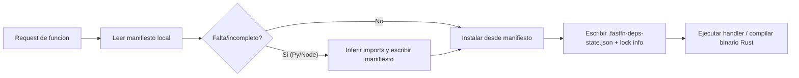

# Especificación de funciones


> Estado verificado al **13 de marzo de 2026**.
> Nota de runtime: FastFN resuelve dependencias y build por función según el runtime: Python usa `requirements.txt`, Node usa `package.json`, PHP instala desde `composer.json` cuando existe, y Rust compila handlers con `cargo`. En `fastfn dev --native` necesitas runtimes y herramientas del host; `fastfn dev` depende de un daemon de Docker activo.
## Nombres y rutas

- nombre (flat): `^[a-zA-Z0-9_-]+$`
- nombre (namespaced): `<segmento>/<segmento>/.../<nombre>` donde cada segmento cumple `^[a-zA-Z0-9_-]+$`
- versión: `^[a-zA-Z0-9_.-]+$`
- rutas públicas (por defecto):
  - `/<name>` (flat)
  - `/<segmento>/<segmento>/.../<nombre>` (namespaced — la estructura de directorios se mapea a rutas, estilo Next.js)
  - `/<name>@<version>`

Los nombres con namespace mapean la estructura de directorios directamente a rutas URL:

| Path en disco (bajo carpeta runtime) | Nombre de función | Ruta |
|---------------------------------------|-------------------|------|
| `hello/app.py` | `hello` | `/hello` |
| `alice/hello/app.py` | `alice/hello` | `/alice/hello` |
| `api/v1/users/app.py` | `api/v1/users` | `/api/v1/users` |

Casos de uso: plataformas multi-tenant (`alice/hello`, `bob/greet`), namespacing de APIs (`api/v1/users`), agrupación organizacional (`team/service/handler`).

## Estado de runtimes

Implementados y ejecutables hoy:

- `python`
- `node`
- `php`
- `lua` (in-process)

Experimentales (opt-in via `FN_RUNTIMES`):

- `rust`
- `go`

## Root de funciones configurable

FastFN descubre funciones escaneando un directorio del filesystem.

Setup común (recomendado):

1. Crear `functions/` en tu repo.
2. Correr `fastfn dev functions` (o setear `"functions-dir": "functions"` en `fastfn.json`).

También puedes controlar discovery con:

- `FN_RUNTIMES` (CSV, ejemplo `python,node,php,rust`)
- `FN_RUNTIME_SOCKETS` (JSON runtime -> socket URI)
- `FN_SOCKET_BASE_DIR` (base de sockets si no hay mapa explícito)

Precedencia de runtime (cuando hay colisiones):

- Si el mismo nombre existe en varios runtimes, `/<name>` usa el primer runtime en `FN_RUNTIMES`.
- Si `FN_RUNTIMES` no está definido, usa orden alfabético de carpetas runtime.

## Cableado de procesos runtime

El cableado global de runtimes vive fuera de `fn.config.json`.

Controles principales:

- `FN_RUNTIMES` para habilitar runtimes
- `runtime-daemons` o `FN_RUNTIME_DAEMONS` para definir counts por runtime externo
- `FN_RUNTIME_SOCKETS` para pasar un mapa explícito de sockets
- `runtime-binaries` o `FN_*_BIN` para elegir el ejecutable del host usado por cada runtime o herramienta

Reglas importantes:

- `lua` corre dentro de OpenResty, así que los counts para `lua` se ignoran.
- `FN_RUNTIME_SOCKETS` acepta string o array por runtime.
- Si defines `FN_RUNTIME_SOCKETS`, gana sobre los sockets generados desde `runtime-daemons`.
- FastFN elige un ejecutable por clave. Si ejecutas tres daemons de Python, los tres usan el mismo `FN_PYTHON_BIN`.

Ejemplo:

```json
{
  "runtime-daemons": {
    "node": 3,
    "python": 3
  },
  "runtime-binaries": {
    "python": "python3.12",
    "node": "node20"
  }
}
```

## Archivos de codigo

Runtime implementado:

- Python: `app.py` o `handler.py`
- Node: `app.js` o `handler.js`
- PHP: `app.php` o `handler.php`
- Rust: `app.rs` o `handler.rs`

## Estructura (relativa a `FN_FUNCTIONS_ROOT`)

```text
<FN_FUNCTIONS_ROOT>/
  python/<name>[/<version>]/app.py|handler.py
  node/<name>[/<version>]/app.js|handler.js
  php/<name>[/<version>]/app.php|handler.php
  rust/<name>[/<version>]/app.rs|handler.rs
```

### Namespaces anidados (estilo Next.js)

Los directorios anidados bajo una carpeta de runtime se mapean directamente a rutas URL:

```text
python/
  hello/app.py                    # GET /hello
  api/
    v1/
      users/app.py                # GET /api/v1/users
      orders/app.py               # GET /api/v1/orders
  alice/
    dashboard/app.py              # GET /alice/dashboard
```

El discovery recursa en directorios que no contienen un archivo handler, tratándolos como segmentos de namespace. Un directorio que contiene un handler (`app.py`, `handler.js`, etc.) se trata como una función.

**Límite de profundidad**: `FN_NAMESPACE_DEPTH` controla cuántos niveles profundiza el scanner (default `3`, max `5`). Por ejemplo, con depth 3 el path `python/a/b/c/app.py` se descubre como función `a/b/c` → ruta `/a/b/c`.

!!! note "Límites de Profundidad"
    El ajuste `FN_NAMESPACE_DEPTH` controla los directorios agrupados por runtime (ej. `python/`, `node/`).
    Las rutas zero-config basadas en archivos usan un límite de profundidad fijo separado de **6 niveles**.

Archivos opcionales por funcion/version:

- `fn.config.json`
- `fn.env.json`
- `requirements.txt` (Python)
- `package.json`, `package-lock.json` (Node)
- `composer.json`, `composer.lock` (PHP, opcional)
- `Cargo.toml`, `Cargo.lock` (Rust, opcional)

## Ejemplos minimos de handler (mismo contrato)

Todos consumen `event`. El contrato portable recomendado es devolver `{status, headers, body}`.

### Python

```python
import json

def handler(event):
    name = (event.get("query") or {}).get("name", "world")
    return {
        "status": 200,
        "headers": {"Content-Type": "application/json"},
        "body": json.dumps({"hello": name}),
    }
```

### Node

```js
exports.handler = async (event) => {
  const query = event.query || {};
  const name = query.name || 'world';
  return {
    status: 200,
    headers: { 'Content-Type': 'application/json' },
    body: JSON.stringify({ hello: name }),
  };
};
```

### PHP

```php
<?php
function handler($event) {
    $query = $event['query'] ?? [];
    $name = $query['name'] ?? 'world';

    return [
        'status' => 200,
        'headers' => ['Content-Type' => 'application/json'],
        'body' => json_encode(['hello' => $name]),
    ];
}
```

### Rust

```rust
use serde_json::{json, Value};

pub fn handler(event: Value) -> Value {
    let name = event
        .get("query")
        .and_then(|q| q.get("name"))
        .and_then(|n| n.as_str())
        .unwrap_or("mundo");

    json!({
        "status": 200,
        "headers": { "Content-Type": "application/json" },
        "body": json!({ "hello": name }).to_string()
    })
}
```

## Respuesta sencilla (atajos por runtime)

El contrato canonico portable sigue siendo:

- `{ status, headers, body }`
- o binario `{ status, headers, is_base64, body_base64 }`

Soporte de atajos por runtime:

| Runtime | Soporte de atajos | Notas |
|---|---|---|
| Node | si | normaliza automaticamente valores sin envelope |
| Python | parcial | normaliza `dict` sin envelope y tuplas |
| PHP | si | normaliza primitivos/arrays/objetos |
| Lua | si | normaliza valores sin envelope como JSON `200` |
| Go | no | requiere envelope explicito |
| Rust | no | requiere envelope explicito |

Para mantener paridad entre runtimes, usa respuesta explicita en ejemplos compartidos.

## `fn.config.json`

Campos clave:

- `timeout_ms`
- `max_concurrency`
- `max_body_bytes`
- `group` (opcional)
- `shared_deps` (opcional)
- `edge` (opcional, passthrough tipo edge)
- `include_debug_headers`
- `schedule` (cron simple por intervalo, opcional)
- `invoke.methods`
- `invoke.handler` (opcional, nombre de funcion exportada; default `handler`)
- `invoke.routes` (mapeo opcional de endpoint publico)
- `invoke.force-url` (opcional, si `true` puede sobrescribir una URL ya mapeada)
- `invoke.adapter` (Beta, Node/Python): modo de compatibilidad (`native`, `aws-lambda`, `cloudflare-worker`)
- `home` (opcional, overlay por carpeta/root):
  - `home.route` o `home.function`: path interno a ejecutar como home.
  - `home.redirect`: URL/path para redirección home (`302`).
- `invoke.summary`
- `invoke.query`
- `invoke.body`

Ejemplo:

```json
{
  "group": "demos",
  "shared_deps": ["common_http"],
  "timeout_ms": 1500,
  "max_concurrency": 10,
  "max_body_bytes": 1048576,
  "include_debug_headers": false,
  "invoke": {
    "handler": "main",
    "adapter": "native",
    "force-url": false,
    "methods": ["GET", "POST"],
    "routes": ["/api/mi-funcion"],
    "summary": "Mi funcion",
    "query": {"name": "World"},
    "body": ""
  },
  "home": {
    "route": "/api/mi-funcion"
  }
}
```

Notas:

- `invoke.handler` permite estilo Lambda con nombre de handler custom (`main`, `run`, etc.).
- En runtimes Node y Python, esa función debe existir/exportarse en el mismo archivo.
- `invoke.routes` es opcional.
- Si existe, cada ruta debe ser absoluta (por ejemplo `/api/mi-funcion`).
- En layout por archivos, `home.route` permite aliasar la raíz de una carpeta (por ejemplo `/portal`) hacia otra ruta detectada en esa carpeta (por ejemplo `/portal/dashboard`).
- En `fn.config.json` raíz, `home.route`/`home.redirect` permite override de `/` sin editar Nginx.
- Prefijos reservados no permitidos (`/_fn`, `/console`, `/docs`).
- Conflictos de rutas devuelven `409`.
- Por defecto, FastFN no sobrescribe silenciosamente un mapeo de URL existente.
- Usa `invoke.force-url: true` solo cuando realmente quieres que esta función se quede con una ruta (por ejemplo, durante una migración).
- Los configs por versión (por ejemplo `mi-fn/v2/fn.config.json`) no pueden \"tomar\" una URL existente por sí solos; usa `FN_FORCE_URL=1` si necesitas que una ruta versionada gane.
- Override global: setea `FN_FORCE_URL=1` (o `fastfn dev --force-url`) para tratar todas las rutas config/policy como forced.

### `keep_warm`

La configuración `keep_warm` indica al scheduler que mantenga la función cargada y lista.

- `enabled`: activa el scheduler de keep-warm.
- `min_warm`: cantidad mínima a mantener caliente.
- `ping_every_seconds`: intervalo entre heartbeats.
- `idle_ttl_seconds`: cuánto tiempo puede quedar ociosa antes de enfriarse.

### `worker_pool`

`worker_pool` es la forma más simple de controlar una función sin cambiar sus rutas.

Detalle importante del modelo:

- `worker_pool` es **por función**.
- `runtime-daemons` es **por runtime** y vive en `fastfn.json` o en variables de entorno, no en `fn.config.json`.
- OpenResty/Lua aplica `worker_pool.max_workers`, `max_queue` y timeouts de cola **antes** de entrar al runtime.
- Después de admitir la request, el gateway elige un socket sano del runtime. Si el runtime tiene más de un socket, la selección es `round_robin`.

Ejemplo:

```json
{
  "worker_pool": {
    "enabled": true,
    "max_workers": 3,
    "max_queue": 6,
    "queue_timeout_ms": 5000,
    "idle_ttl_seconds": 300,
    "overflow_status": 429
  }
}
```

Campos principales:

- `enabled`: activa la ejecución con pool para esa función.
- `max_workers`: máximo de ejecuciones activas admitidas para la función.
- `max_queue`: requests extra permitidas en cola cuando todos los workers están ocupados.
- `queue_timeout_ms`: cuánto puede esperar una request en cola antes de devolver `overflow_status`.
- `idle_ttl_seconds`: cuánto tiempo permanecen vivos los workers ociosos antes de limpiarse.
- `overflow_status`: estado de respuesta al desbordar cola o agotar espera (`429` o `503`).
- `min_warm`: mantiene algunos workers ya creados cuando el runtime lo soporta.

Comportamiento actual por runtime:

| Runtime | Routing multi-daemon | Fan-out interno del runtime |
|---|---|---|
| Node | soportado | además usa workers hijos dentro de `node-daemon.js` |
| Python | soportado | la ejecución sigue dependiendo del comportamiento del daemon Python |
| PHP | soportado | el despacho sucede mediante el lanzador PHP |
| Rust | soportado | el despacho sucede mediante el binario compilado |
| Lua | no aplica | corre dentro de OpenResty |

Benchmark native observado el **13 de marzo de 2026** (`6` requests concurrentes a un handler con `sleep(200ms)` en host local, `1` vs `3` runtime daemons):

- Node: `267.2ms` -> `232.4ms` (`13.0%` más rápido)
- Python: `1281.9ms` -> `447.4ms` (`65.1%` más rápido)
- PHP: `629.4ms` -> `862.5ms` (`37.0%` más lento)
- Rust: `384.6ms` -> `417.7ms` (`8.6%` más lento)

Artefacto crudo:

- `tests/stress/results/2026-03-13-runtime-daemon-scaling-native.json`

La lectura práctica es simple: conviene medir tu propia carga antes de activar más daemons en todos los runtimes.

### `invoke.adapter` (Beta)

Usa `invoke.adapter` cuando quieras portar handlers existentes con cambios mínimos.

- `native` (default): contrato FastFN (`handler(event)`).
- `aws-lambda`: compatibilidad Node/Python para handlers estilo Lambda.
- `cloudflare-worker`: compatibilidad Node/Python para handlers estilo Workers (`fetch(request, env, ctx)`).

Nota Node + Lambda callback:

- En modo `aws-lambda`, Node soporta tanto handlers async como handlers con callback (`event, context, callback`).

## Config edge passthrough (`edge`)

Si quieres un comportamiento estilo Cloudflare Workers (el handler devuelve un `proxy` y el gateway hace el request saliente), habilítalo por función en `fn.config.json`:

```json
{
  "edge": {
    "base_url": "https://api.example.com",
    "allow_hosts": ["api.example.com"],
    "allow_private": false,
    "max_response_bytes": 1048576
  }
}
```

Después el handler puede devolver `{ "proxy": { ... } }`. Ver el contrato completo en: **Contrato Runtime**.

## Gestion de dependencias (auto-install + inferencia)

FastFN resuelve dependencias o build por carpeta de función y agrega inferencia autónoma para Python/Node.

Modelo de resolucion:

- Python, Node y PHP usan manifiestos locales por función (`requirements.txt`, `package.json`, `composer.json`).
- Los handlers Rust se compilan con `cargo` dentro de un workspace `.rust-build/` por función.
- FastFN no busca automaticamente dependencias en la raiz del repo.
- Para reutilizacion entre muchas funciones, usa `shared_deps`.
- El runtime deja trazabilidad en `<function_dir>/.fastfn-deps-state.json`.

### Python (manifiesto + inferencia)

Entradas soportadas:

- `requirements.txt`
- hints inline `#@requirements ...`
- inferencia de imports cuando falta o esta incompleto el manifiesto

Comportamiento:

- Si falta `requirements.txt` y la inferencia resuelve imports, FastFN lo crea automaticamente.
- Si `requirements.txt` existe, agrega paquetes faltantes inferidos sin borrar tus pins.
- Tras una instalacion exitosa, escribe `requirements.lock.txt` (lock informativo en v1).

Toggles:

- `FN_AUTO_REQUIREMENTS=0` desactiva auto-install de Python.
- `FN_AUTO_INFER_PY_DEPS=0` desactiva inferencia Python.
- `FN_AUTO_INFER_WRITE_MANIFEST=0` evita escribir manifiestos desde inferencia.
- `FN_AUTO_INFER_STRICT=1` falla si hay imports no resolubles.
- `FN_PREINSTALL_PY_DEPS_ON_START=1` preinstala deps al iniciar runtime.

### Node (manifiesto + inferencia)

Entradas soportadas:

- `package.json`
- inferencia de `import/require` para dependencias faltantes

Comportamiento:

- Si falta `package.json` y hay imports resolubles, FastFN crea `package.json`.
- Si existe `package.json`, agrega dependencias faltantes inferidas.
- Con lockfile usa `npm ci`; sin lockfile usa `npm install`.

Toggles:

- `FN_AUTO_NODE_DEPS=0` desactiva auto-install de Node.
- `FN_AUTO_INFER_NODE_DEPS=0` desactiva inferencia Node.
- `FN_AUTO_INFER_WRITE_MANIFEST=0` evita escritura de manifiesto inferido.
- `FN_AUTO_INFER_STRICT=1` activa fail-fast en imports no resolubles.
- `FN_PREINSTALL_NODE_DEPS_ON_START=1` preinstala deps al iniciar.
- `FN_PREINSTALL_NODE_DEPS_CONCURRENCY=4` controla concurrencia de preinstall.

### PHP (solo manifiesto en esta fase)

- Usa `composer.json` (y opcionalmente `composer.lock`) por funcion.
- FastFN ejecuta `composer install` por funcion cuando corresponde.
- No hay inferencia por imports en PHP en esta fase.
- `FN_AUTO_PHP_DEPS=0` desactiva auto-install de Composer.

### Rust (build en esta fase)

Comportamiento:

- FastFN compila handlers Rust con `cargo build --release`.
- El runtime prepara un workspace `.rust-build/` por función y compila el handler allí.
- No hay inferencia por imports para Rust en esta fase.
- El modo native requiere `cargo` en `PATH`.

### Errores estrictos y transparencia

- Si la inferencia no resuelve imports (con strict activo), la invocacion falla con error accionable.
- Los fallos de install o build muestran un tail corto de pip/npm/composer/cargo para debug rapido.
- `GET /_fn/function` expone `metadata.dependency_resolution`.



## Packs de dependencias compartidas (`shared_deps`)

Si quieres que varias funciones reutilicen la misma instalación de dependencias (por ejemplo: un `node_modules` compartido para Node, o una carpeta de pip compartida para Python), puedes usar packs compartidos.

En `fn.config.json`:

```json
{
  "shared_deps": ["qrcode_pack"]
}
```

Los packs viven dentro del root de funciones (funciona con el volumen default de Docker):

```text
<FN_FUNCTIONS_ROOT>/.fastfn/packs/<runtime>/<pack>/
```

Ejemplos:

- Pack Python: `<FN_FUNCTIONS_ROOT>/.fastfn/packs/python/qrcode_pack/requirements.txt`
- Pack Node: `<FN_FUNCTIONS_ROOT>/.fastfn/packs/node/qrcode_pack/package.json`
- Pack Node TypeScript (esbuild): `<FN_FUNCTIONS_ROOT>/.fastfn/packs/node/ts_pack/package.json`

En runtime:

- Python instala en `<pack>/.deps` y lo agrega a `sys.path`
- Node instala en `<pack>/node_modules` y lo agrega a la resolucion de modulos para esa invocacion

Esto no es aislamiento nivel kernel (virtualenv/cargo completo), pero sirve para deduplicar instalaciones de forma simple.

## Schedule (cron o intervalo)

Puedes adjuntar un schedule a una funcion usando:

- `every_seconds` (intervalo)
- `cron` (expresion cron)

### Schedule por intervalo (`every_seconds`)

```json
{
  "schedule": {
    "enabled": true,
    "every_seconds": 60,
    "method": "GET",
    "query": {},
    "headers": {},
    "body": "",
    "context": {}
  }
}
```

### Schedule cron (`cron`)

Cron soporta:

- 5 campos: `min hour dom mon dow`
- 6 campos: `sec min hour dom mon dow`
- macros: `@hourly`, `@daily`, `@weekly`, `@monthly`, `@yearly`

```json
{
  "schedule": {
    "enabled": true,
    "cron": "*/5 * * * *",
    "timezone": "UTC",
    "method": "GET",
    "query": {},
    "headers": {},
    "body": "",
    "context": {}
  }
}
```

Timezones:

- `UTC`, `Z`
- `local` (default si se omite)
- offsets fijos como `+02:00` o `-05:00`

- El scheduler corre dentro de OpenResty (worker 0).
- Invoca el runtime por unix socket.
- La policy aplica igual (metodos, body, concurrencia, timeout).
- Para correr cada **X minutos**, usa `every_seconds = X * 60` (ejemplo: 15 minutos => `900`).
- Estado del scheduler: `GET /_fn/schedules` (`next`, `last`, `last_status`, `last_error`).
- Los schedules se guardan en `fn.config.json` (la definicion persiste entre restarts).
- El estado del scheduler se persiste por defecto en `<FN_FUNCTIONS_ROOT>/.fastfn/scheduler-state.json` (para mantener `last/next/status/error` entre restarts).
- Fallos comunes (`last_status` / `last_error`):
  - `405`: el `method` del schedule no esta permitido por la policy de la funcion.
  - `413`: el `body` excedio `max_body_bytes`.
  - `429`: la funcion estaba ocupada (gate de concurrencia).
  - `503`: runtime caido/no saludable.
- Retry/backoff (opcional):
  - Setea `schedule.retry=true` para defaults, o un objeto:
  - `max_attempts` (default `3`), `base_delay_seconds` (default `1`), `max_delay_seconds` (default `30`), `jitter` (default `0.2`).
  - Retries aplican a status `0`, `429`, `503` y `>=500`. El scheduler actualiza `last_error` con `retrying ...`.
- Consola: `GET /console/scheduler` muestra schedules + keep_warm (requiere `FN_UI_ENABLED=1`).
- Toggles globales:
  - `FN_SCHEDULER_ENABLED=0` deshabilita el scheduler.
  - `FN_SCHEDULER_INTERVAL` controla el tick (default `1` segundo).
  - `FN_SCHEDULER_PERSIST_ENABLED=0` deshabilita persistencia de estado.
  - `FN_SCHEDULER_PERSIST_INTERVAL` controla cada cuánto se escribe el estado (segundos).
  - `FN_SCHEDULER_STATE_PATH` permite override del path del archivo.

## `fn.env.json` y secretos

- `fn.env.json`: valores inyectados en `event.env`
- los secretos se marcan en el mismo archivo con `is_secret`

Ejemplo:

```json
{
  "API_KEY": {"value": "secret-value", "is_secret": true},
  "PUBLIC_FLAG": {"value": "on", "is_secret": false}
}
```

## Diagrama de Flujo de Ejecución


## Contrato

Define la forma esperada de request/response, campos de configuración y garantías de comportamiento.

## Ejemplo End-to-End

Usa los ejemplos de esta página como plantillas canónicas para implementación y testing.

## Casos Límite

- Fallbacks ante configuración faltante
- Conflictos de rutas y precedencia
- Matices por runtime

## Ver también

- [Referencia API HTTP](api-http.md)
- [Checklist Ejecutar y Probar](../como-hacer/ejecutar-y-probar.md)
- [Arquitectura](../explicacion/arquitectura.md)
