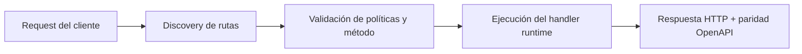

# Autenticación y Secretos


> Estado verificado al **10 de marzo de 2026**.
> Nota de runtime: FastFN auto-instala dependencias locales por función desde `requirements.txt` / `package.json`; en `fastfn dev --native` necesitas runtimes instalados en host, mientras que `fastfn dev` depende de Docker daemon activo.
En FastFN, la seguridad se maneja **en el código**. Tenés acceso total a headers, variables de entorno y el contexto de la petición para implementar cualquier estrategia de autenticación.

---

## 1. Almacenar Secretos (Variables de Entorno)

Nunca escribas claves de API (API keys) o contraseñas de base de datos directamente en tu `app.py` o `index.js`.
En su lugar, usa un archivo `fn.env.json` en la carpeta de la función.

**Archivo:** `functions/api-segura/fn.env.json`
```json
{
  "API_SECRET": {"value": "clave-super-secreta-123", "is_secret": true},
  "DB_PASSWORD": {"value": "contrasenia-correcta", "is_secret": true}
}
```

La plataforma inyecta estos automáticamente en `event['env']` (Python) o `event.env` (Node.js).

---

## 2. Implementar Auth con API Key

Este es el patrón más común para comunicación servidor-a-servidor.

**Archivo:** `functions/api-segura/app.py`

```python
import json

def handler(event):
    headers = event.get('headers', {})
    env = event.get('env', {})
    
    # 1. Recuperar la clave provista (OpenResty minúsculiza los headers)
    provided_key = headers.get('x-api-key')
    
    # 2. Comparar con el secreto esperado
    expected_key = env.get('API_SECRET')
    
    if not provided_key or provided_key != expected_key:
        return {
            "status": 401,
            "headers": {"Content-Type": "application/json"},
            "body": json.dumps({"error": "No Autorizado: API Key inválida"})
        }

    return {
        "status": 200,
        "headers": {"Content-Type": "application/json"},
        "body": json.dumps({"message": "¡Estás dentro!"})
    }
```

**Pruébalo:**

```bash
# Fallo
curl -i 'http://127.0.0.1:8080/api-segura'

# Éxito
curl -i 'http://127.0.0.1:8080/api-segura' \
  -H 'x-api-key: clave-super-secreta-123'
```

---

## 3. Autenticación Básica (Usuario/Contraseña)

Manejando el header estándar `Authorization: Basic <base64>`.

**Archivo:** `functions/auth-basica/index.js`

```javascript
exports.handler = async (event) => {
    const headers = event.headers || {};
    const auth = headers['authorization'];
    
    if (!auth || !auth.startsWith('Basic ')) {
        return {
            status: 401,
            headers: { 'WWW-Authenticate': 'Basic realm="Area Segura"' },
            body: JSON.stringify({ error: "Falta Auth Básica" })
        };
    }

    // Decodificar Base64
    const base64Credentials = auth.split(' ')[1];
    const credentials = Buffer.from(base64Credentials, 'base64').toString('ascii');
    const [username, password] = credentials.split(':');

    if (username === 'admin' && password === 'secreto123') {
        return {
          status: 200,
          headers: { 'Content-Type': 'application/json' },
          body: JSON.stringify({ message: "¡Bienvenido, Admin!" })
        };
    }

    return {
      status: 403,
      headers: { 'Content-Type': 'application/json' },
      body: JSON.stringify({ error: "Prohibido" })
    };
};
```

---

## 4. Evitar Fugas de Datos Sensibles

Revisar tus logs es importante. Por defecto, FastFN registra detalles de ejecución.

!!! warning "No imprimas secretos"
    Evita código como `print(env)` o `console.log(event.env)`.
    Si necesitas depurar, imprime solo claves seguras o valores enmascarados.

```python
# BIEN
print(f"Auth check: clave_provista={bool(provided_key)}")

# MAL
print(f"Auth check: clave={provided_key}") 
```

## Diagrama de Flujo



## Objetivo

Alcance claro, resultado esperado y público al que aplica esta guía.

## Prerrequisitos

- CLI de FastFN disponible
- Dependencias por modo verificadas (Docker para `fastfn dev`, OpenResty+runtimes para `fastfn dev --native`)

## Checklist de Validación

- Los comandos de ejemplo devuelven estados esperados
- Las rutas aparecen en OpenAPI cuando aplica
- Las referencias del final son navegables

## Solución de Problemas

- Si un runtime cae, valida dependencias de host y endpoint de health
- Si faltan rutas, vuelve a ejecutar discovery y revisa layout de carpetas

## Ver también

- [Especificación de Funciones](../referencia/especificacion-funciones.md)
- [Referencia API HTTP](../referencia/api-http.md)
- [Checklist Ejecutar y Probar](../como-hacer/ejecutar-y-probar.md)
