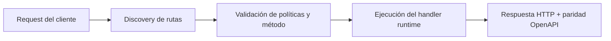

# Construir una API completa


> Estado verificado al **10 de marzo de 2026**.
> Nota de runtime: FastFN auto-instala dependencias locales por función desde `requirements.txt` / `package.json`; en `fastfn dev --native` necesitas runtimes instalados en host, mientras que `fastfn dev` depende de Docker daemon activo.
En este tutorial crearás un endpoint realista con:

- `GET` y `POST`
- auth por API key
- validación JSON
- códigos HTTP explícitos
- metadata para OpenAPI

Usaremos `perfil-cliente` como nombre de función.

## 0) Requisitos

- Plataforma levantada en `http://127.0.0.1:8080`
- Escritura de consola habilitada (`FN_CONSOLE_WRITE_ENABLED=1`) o token admin

## 1) Crear función

```bash
curl -sS 'http://127.0.0.1:8080/_fn/function?runtime=python&name=perfil-cliente' \
  -X POST \
  -H 'Content-Type: application/json' \
  --data '{"methods":["GET","POST"],"summary":"API de perfil de cliente"}'
```

## 2) Configurar política (métodos, límites, hints OpenAPI)

```bash
curl -sS 'http://127.0.0.1:8080/_fn/function-config?runtime=python&name=perfil-cliente' \
  -X PUT \
  -H 'Content-Type: application/json' \
  --data '{
    "timeout_ms": 1800,
    "max_concurrency": 8,
    "max_body_bytes": 262144,
    "invoke": {
      "methods": ["GET", "POST"],
      "summary": "Leer o actualizar perfil de cliente",
      "query": {"id": "cli_100"},
      "body": "{\"email\":\"alicia@ejemplo.com\"}"
    }
  }'
```

## 3) Guardar secreto en env

```bash
curl -sS 'http://127.0.0.1:8080/_fn/function-env?runtime=python&name=perfil-cliente' \
  -X PUT \
  -H 'Content-Type: application/json' \
  --data '{"API_SECRET":{"value":"clave-demo-123","is_secret":true}}'
```

## 4) Subir código de handler funcional

```bash
curl -sS 'http://127.0.0.1:8080/_fn/function-code?runtime=python&name=perfil-cliente' \
  -X PUT \
  -H 'Content-Type: application/json' \
  --data '{"code":"import json\n\ndef j(status, payload):\n    return {\n        \"status\": status,\n        \"headers\": {\"Content-Type\": \"application/json\"},\n        \"body\": json.dumps(payload, separators=(\",\", \":\")),\n    }\n\ndef handler(event):\n    method = str(event.get(\"method\") or \"GET\").upper()\n    query = event.get(\"query\") or {}\n    headers = event.get(\"headers\") or {}\n    env = event.get(\"env\") or {}\n\n    if headers.get(\"x-api-key\") != env.get(\"API_SECRET\"):\n        return j(401, {\"error\": \"unauthorized\"})\n\n    if method == \"GET\":\n        cid = query.get(\"id\")\n        if not cid:\n            return j(400, {\"error\": \"falta query param id\"})\n        return j(200, {\"id\": cid, \"name\": \"Alicia Perez\", \"tier\": \"gold\", \"active\": True})\n\n    if method == \"POST\":\n        raw = event.get(\"body\") or \"{}\"\n        try:\n            payload = json.loads(raw)\n        except Exception:\n            return j(400, {\"error\": \"json body invalido\"})\n\n        email = payload.get(\"email\") if isinstance(payload, dict) else None\n        if not email:\n            return j(422, {\"error\": \"email es obligatorio\"})\n\n        return j(200, {\"updated\": True, \"email\": email, \"fields\": sorted(list(payload.keys())) if isinstance(payload, dict) else []})\n\n    return j(405, {\"error\": \"method not allowed\"})\n"}'
```

## 5) Validar comportamiento

### No autorizado (sin key)

```bash
curl -i -sS 'http://127.0.0.1:8080/perfil-cliente?id=cli_100'
```

Esperado: `401`.

### GET válido

```bash
curl -i -sS 'http://127.0.0.1:8080/perfil-cliente?id=cli_100' \
  -H 'x-api-key: clave-demo-123'
```

Esperado: `200` + JSON de perfil.

### POST con JSON inválido

```bash
curl -i -sS -X POST 'http://127.0.0.1:8080/perfil-cliente' \
  -H 'x-api-key: clave-demo-123' \
  -H 'Content-Type: application/json' \
  -d '{json malo}'
```

Esperado: `400`.

### POST sin campo requerido

```bash
curl -i -sS -X POST 'http://127.0.0.1:8080/perfil-cliente' \
  -H 'x-api-key: clave-demo-123' \
  -H 'Content-Type: application/json' \
  -d '{"name":"Alicia"}'
```

Esperado: `422`.

### POST válido

```bash
curl -i -sS -X POST 'http://127.0.0.1:8080/perfil-cliente' \
  -H 'x-api-key: clave-demo-123' \
  -H 'Content-Type: application/json' \
  -d '{"email":"alicia@ejemplo.com","newsletter":false}'
```

Esperado: `200`.

## 6) Verificar OpenAPI / Swagger

```bash
curl -sS 'http://127.0.0.1:8080/openapi.json' | rg 'perfil-cliente|"get"|"post"'
```

- Swagger UI: [http://127.0.0.1:8080/docs](http://127.0.0.1:8080/docs)

## 7) Limpieza opcional

```bash
curl -sS 'http://127.0.0.1:8080/_fn/function?runtime=python&name=perfil-cliente' -X DELETE
```

[Siguiente: Versionado y Rollout :arrow_right:](./versionado-y-rollout.md){ .md-button }

## Diagrama de Flujo



## Objetivo

Alcance claro, resultado esperado y público al que aplica esta guía.

## Prerrequisitos

- CLI de FastFN disponible
- Dependencias por modo verificadas (Docker para `fastfn dev`, OpenResty+runtimes para `fastfn dev --native`)

## Checklist de Validación

- Los comandos de ejemplo devuelven estados esperados
- Las rutas aparecen en OpenAPI cuando aplica
- Las referencias del final son navegables

## Solución de Problemas

- Si un runtime cae, valida dependencias de host y endpoint de health
- Si faltan rutas, vuelve a ejecutar discovery y revisa layout de carpetas

## Ver también

- [Especificación de Funciones](../referencia/especificacion-funciones.md)
- [Referencia API HTTP](../referencia/api-http.md)
- [Checklist Ejecutar y Probar](../como-hacer/ejecutar-y-probar.md)
