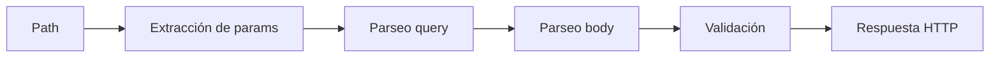

# Parte 2: Enrutamiento y Datos

> Estado verificado al **13 de marzo de 2026**.
> Nota de runtime: FastFN auto-instala dependencias locales por función desde `requirements.txt` / `package.json`; en `fastfn dev --native` necesitas runtimes instalados en host, mientras que `fastfn dev` depende de Docker daemon activo.

## Vista rápida

- Complejidad: Intermedio
- Tiempo típico: 25-35 minutos
- Resultado: manejo de path/query/body dinámico con errores de validación explícitos

## 1. Path params: simple y catch-all

Crea estos archivos:

```text
node/
  tasks/
    [id].js
  reports/
    [...slug].js
```

`node/tasks/[id].js`:

```js
exports.handler = async (_event, { id }) => ({
  status: 200,
  body: { task_id: id }
});
```

`node/reports/[...slug].js`:

```js
exports.handler = async (_event, { slug }) => ({
  status: 200,
  body: { path: slug }
});
```

Validación:

```bash
curl -sS 'http://127.0.0.1:8080/tasks/42'
curl -sS 'http://127.0.0.1:8080/reports/2026/03/daily'
```

Esperado:

```json
{"task_id":"42"}
{"path":"2026/03/daily"}
```

## 2. Query params: requeridos, opcionales y defaults

`node/tasks/search.js`:

```js
exports.handler = async (event) => {
  const q = event.query?.q;
  const page = Number(event.query?.page || "1");

  if (!q) {
    return { status: 400, body: { error: "q es requerido" } };
  }

  return { status: 200, body: { q, page } };
};
```

Validación:

```bash
curl -sS 'http://127.0.0.1:8080/tasks/search?page=2'
curl -sS 'http://127.0.0.1:8080/tasks/search?q=fastfn'
```

Esperado:

```json
{"error":"q es requerido"}
{"q":"fastfn","page":1}
```

## 3. Parseo de body JSON y casos de error

`node/tasks/post.js`:

```js
exports.handler = async (event) => {
  let payload;
  try {
    payload = JSON.parse(event.body || "{}");
  } catch (_err) {
    return { status: 400, body: { error: "JSON body inválido" } };
  }

  if (!payload.title || typeof payload.title !== "string") {
    return { status: 422, body: { error: "title debe ser string no vacío" } };
  }

  return { status: 201, body: { id: 3, title: payload.title } };
};
```

Validación:

```bash
curl -sS -X POST 'http://127.0.0.1:8080/tasks' -H 'Content-Type: application/json' -d '{bad'
curl -sS -X POST 'http://127.0.0.1:8080/tasks' -H 'Content-Type: application/json' -d '{}'
curl -sS -X POST 'http://127.0.0.1:8080/tasks' -H 'Content-Type: application/json' -d '{"title":"Escribir docs"}'
```

Estados/bodies esperados:

- `400` con `{"error":"JSON body inválido"}`
- `422` con `{"error":"title debe ser string no vacío"}`
- `201` con payload de tarea creada

## Diagrama de flujo



## Solución de problemas

- se invoca handler incorrecto: revisa prefijos de método y nombre de carpeta
- params vacíos: confirma patrón `[id]` o `[...slug]`
- parseo de body falla: revisa `Content-Type: application/json` y JSON válido

## Próximo paso

[Ir a la Parte 3: Configuración y Secretos](./3-configuracion-y-secretos.md)

## Enlaces relacionados

- [Validación y schemas](../validacion-y-schemas.md)
- [Metadata de request y archivos](../metadata-request-y-archivos.md)
- [Referencia API HTTP](../../referencia/api-http.md)
