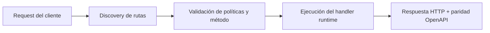

# Parte 2: Enrutamiento y Datos


> Estado verificado al **10 de marzo de 2026**.
> Nota de runtime: FastFN auto-instala dependencias locales por función desde `requirements.txt` / `package.json`; en `fastfn dev --native` necesitas runtimes instalados en host, mientras que `fastfn dev` depende de Docker daemon activo.
En la Parte 1, creamos una lista estática de tareas en `/tasks`. Ahora, hagamos nuestra API dinámica. Queremos obtener una tarea específica por su ID (ej. `/tasks/1`) y añadir nuevas tareas usando una petición `POST`.

## 1. Enrutamiento Dinámico (Obtener una sola tarea)

FastFN usa corchetes `[]` en los nombres de archivo para crear parámetros de ruta dinámicos.

Dentro de tu carpeta `tasks`, crea un nuevo archivo llamado `[id].js` (o `.py`, `.php`).

```text
task-manager-api/
└── tasks/
    ├── handler.js     # -> GET /tasks
    └── [id].js        # -> GET /tasks/:id
```

Añade el siguiente código a `tasks/[id].js`:

=== "Python"
    ```python
    def handler(event, id):
        # 'id' se inyecta directamente desde la ruta URL
        return {
            "status": 200,
            "body": {"message": f"Obteniendo detalles para la tarea {id}"}
        }
    ```

=== "Node.js"
    ```javascript
    exports.handler = async (event, { id }) => {
        // 'id' se desestructura del objeto de parámetros de ruta
        return {
            status: 200,
            body: { message: `Obteniendo detalles para la tarea ${id}` }
        };
    };
    ```

=== "PHP"
    ```php
    <?php
    return function($event, $params) {
        // $params contiene los parámetros de ruta
        $taskId = $params['id'] ?? null;

        return [
            "status" => 200,
            "body" => ["message" => "Obteniendo detalles para la tarea $taskId"]
        ];
    };
    ```

!!! tip "Inyección Directa de Parámetros"
    FastFN inspecciona la firma de tu handler e inyecta los parámetros de ruta
    directamente. En Python, `def handler(event, id)` recibe el valor `:id` como
    segundo argumento. En Node.js, puedes desestructurar: `async (event, { id }) =>`.
    Los parámetros también están siempre disponibles en `event.params` si lo prefieres.

Pruébalo abriendo `http://127.0.0.1:8080/tasks/42` en tu navegador. Deberías ver `{"message": "Obteniendo detalles para la tarea 42"}`.

## 2. Leer el Cuerpo de la Petición (Añadir una tarea)

Por defecto, las rutas de FastFN manejan peticiones `GET`. Para manejar una petición `POST` a `/tasks`, podemos inspeccionar el método HTTP dentro de nuestro archivo principal `tasks/handler.js`.

Actualiza tu `tasks/handler.js` para manejar tanto `GET` como `POST`:

=== "Python"
    ```python
    def handler(event):
        if event.get("method") == "POST":
            # Leer el cuerpo JSON parseado
            new_task = event.get("body")
            return {
                "status": 201,
                "body": {"message": "¡Tarea creada!", "task": new_task}
            }

        # Comportamiento GET por defecto
        return {
            "status": 200,
            "body": [{"id": 1, "title": "Aprender FastFN"}]
        }
    ```

=== "Node.js"
    ```javascript
    exports.handler = async (event) => {
        if (event.method === "POST") {
            // Leer el cuerpo JSON parseado
            const newTask = event.body;
            return {
                status: 201,
                body: { message: "¡Tarea creada!", task: newTask }
            };
        }

        // Comportamiento GET por defecto
        return {
            status: 200,
            body: [{ id: 1, title: "Aprender FastFN" }]
        };
    };
    ```

=== "PHP"
    ```php
    <?php
    return function($event) {
        if (($event['method'] ?? 'GET') === 'POST') {
            $newTask = $event['body'] ?? [];
            return [
                "status" => 201,
                "body" => ["message" => "¡Tarea creada!", "task" => $newTask]
            ];
        }

        return [
            "status" => 200,
            "body" => [["id" => 1, "title" => "Aprender FastFN"]]
        ];
    };
    ```

!!! tip "Alternativa: Archivos por Método"
    En lugar de manejar GET y POST en un solo archivo, puedes crear archivos separados:
    `tasks/get.js` para GET y `tasks/post.js` para POST.
    FastFN infiere el método HTTP del prefijo del nombre de archivo.
    Consulta [Enrutamiento](../routing.md) para más detalles.

Prueba tu nuevo endpoint `POST` usando `curl` o el Swagger UI (`http://127.0.0.1:8080/docs`):

```bash
curl -X POST http://127.0.0.1:8080/tasks \
     -H "Content-Type: application/json" \
     -d '{"title": "Escribir documentación"}'
```

## Siguientes Pasos

¡Nuestra API está tomando forma! Pero, ¿qué pasa si queremos conectarnos a una base de datos real usando un token secreto? En la siguiente parte, aprenderemos cómo gestionar de forma segura las variables de entorno y configurar el comportamiento de nuestra función.

[Ir a la Parte 3: Configuración y Secretos :arrow_right:](./3-configuracion-y-secretos.md)

## Diagrama de Flujo



## Objetivo

Alcance claro, resultado esperado y público al que aplica esta guía.

## Prerrequisitos

- CLI de FastFN disponible
- Dependencias por modo verificadas (Docker para `fastfn dev`, OpenResty+runtimes para `fastfn dev --native`)

## Checklist de Validación

- Los comandos de ejemplo devuelven estados esperados
- Las rutas aparecen en OpenAPI cuando aplica
- Las referencias del final son navegables

## Solución de Problemas

- Si un runtime cae, valida dependencias de host y endpoint de health
- Si faltan rutas, vuelve a ejecutar discovery y revisa layout de carpetas

## Ver también

- [Especificación de Funciones](../../referencia/especificacion-funciones.md)
- [Referencia API HTTP](../../referencia/api-http.md)
- [Checklist Ejecutar y Probar](../../como-hacer/ejecutar-y-probar.md)
