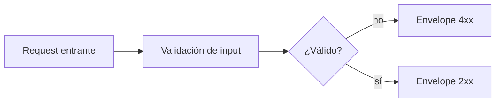

# Parte 4: Respuestas Avanzadas

> Estado verificado al **13 de marzo de 2026**.
> Nota de runtime: FastFN auto-instala dependencias locales por función desde `requirements.txt` / `package.json`; en `fastfn dev --native` necesitas runtimes instalados en host, mientras que `fastfn dev` depende de Docker daemon activo.

## Vista rápida

- Complejidad: Intermedio
- Tiempo típico: 30-40 minutos
- Resultado: contratos de respuesta consistentes con comportamiento multi-status explícito

## 1. Garantía de forma de respuesta

Usa envelope explícito en todos los branches:

```js
exports.handler = async () => ({
  status: 200,
  headers: { "Content-Type": "application/json; charset=utf-8" },
  body: { items: [], total: 0 }
});
```

Forma estable recomendada:

```json
{
  "data": {},
  "error": null,
  "meta": {}
}
```

## 2. Modelos alternativos según estado

`node/tasks/[id]/get.js`:

```js
exports.handler = async (_event, { id }) => {
  if (id === "404") {
    return { status: 404, body: { error: { code: "TASK_NOT_FOUND", message: "task not found" } } };
  }
  return { status: 200, body: { data: { id, title: "Escribir docs" }, error: null } };
};
```

Validación:

```bash
curl -sS 'http://127.0.0.1:8080/tasks/1'
curl -sS 'http://127.0.0.1:8080/tasks/404'
```

## 3. Estrategia de códigos de estado

| Estado | Cuándo usar | Contrato de body |
|---|---|---|
| `200` | lectura/actualización ok | `data` presente, `error: null` |
| `201` | recurso creado | `data` con id creado |
| `202` | trabajo asíncrono aceptado | `job_id` + URL de consulta |
| `400` | request malformado | error con mensaje accionable |
| `404` | recurso/ruta inexistente | código de error + mensaje |
| `409` | conflicto | detalle de conflicto determinista |
| `422` | validación semántica | mensaje por campo/regla |

## 4. Códigos adicionales en un mismo endpoint

`node/tasks/post.js`:

```js
exports.handler = async (event) => {
  const body = JSON.parse(event.body || "{}");
  if (!body.title) return { status: 422, body: { error: "title requerido" } };
  if (body.async === true) return { status: 202, body: { job_id: "job-123", status_url: "/_fn/jobs/job-123" } };
  return { status: 201, body: { id: 99, title: body.title } };
};
```

Validación:

```bash
curl -sS -X POST 'http://127.0.0.1:8080/tasks' -H 'Content-Type: application/json' -d '{}'
curl -sS -X POST 'http://127.0.0.1:8080/tasks' -H 'Content-Type: application/json' -d '{"title":"Docs","async":true}'
curl -sS -X POST 'http://127.0.0.1:8080/tasks' -H 'Content-Type: application/json' -d '{"title":"Docs"}'
```

Estados esperados:

- `422` validación
- `202` aceptado
- `201` creado

## 5. Envelope de errores y pistas operativas

Objeto de error estable:

```json
{
  "error": {
    "code": "VALIDATION_ERROR",
    "message": "title requerido",
    "hint": "enviar title como string no vacío"
  }
}
```

Pistas operativas:

- incluir `trace_id` en `meta` cuando exista
- no exponer stack traces en respuesta pública
- mantener `code` estable entre versiones


## Diagrama de flujo



## Enlaces relacionados

- [Validación y schemas](../validacion-y-schemas.md)
- [Referencia API HTTP](../../referencia/api-http.md)
- [Desplegar a producción](../../como-hacer/desplegar-a-produccion.md)
