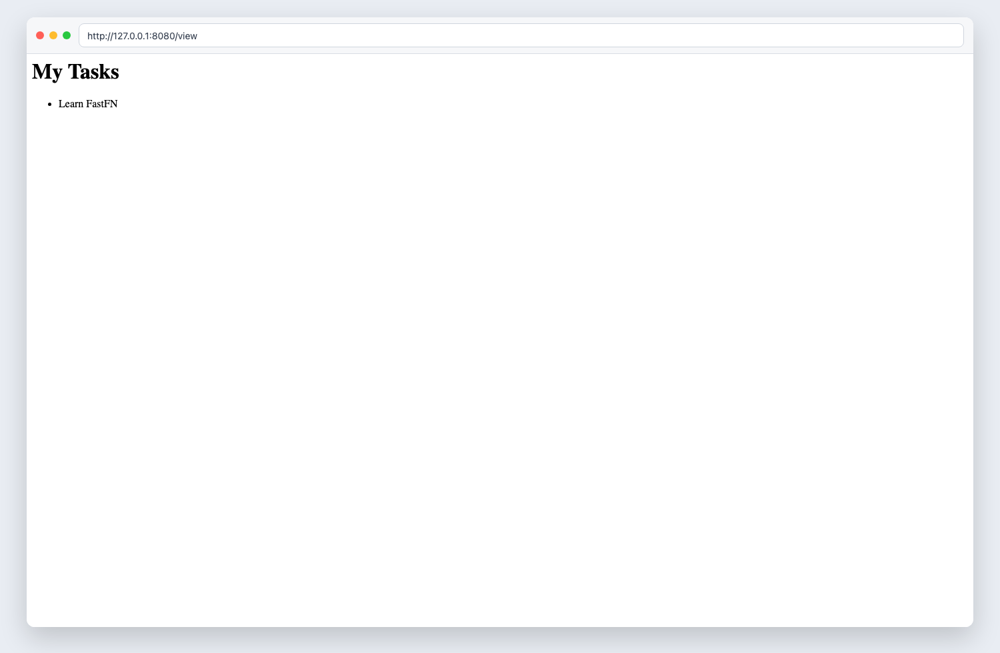

# Parte 4: Respuestas Avanzadas


> Estado verificado al **10 de marzo de 2026**.
> Nota de runtime: FastFN auto-instala dependencias locales por función desde `requirements.txt` / `package.json`; en `fastfn dev --native` necesitas runtimes instalados en host, mientras que `fastfn dev` depende de Docker daemon activo.
Hasta ahora, nuestra API de Tareas solo ha devuelto JSON. Pero FastFN es un framework web completo. Puedes devolver HTML, CSVs, imágenes y configurar cabeceras HTTP personalizadas.

## 1. Devolver HTML

Vamos a crear una página web sencilla para ver nuestras tareas. Crea una nueva carpeta llamada `view` y añade un `handler.js` (o `.py`, `.php`) dentro de ella.

```text
task-manager-api/
├── tasks/
│   └── ...
└── view/
    └── handler.js     # -> GET /view
```

Para devolver HTML, solo necesitas configurar la cabecera `Content-Type` y pasar un string como cuerpo:

=== "Python"
    ```python hl_lines="4 5"
    def handler(event):
        html = "<h1>Mis Tareas</h1><ul><li>Aprender FastFN</li></ul>"
        return {
            "status": 200,
            "headers": {"Content-Type": "text/html; charset=utf-8"},
            "body": html
        }
    ```

=== "Node.js"
    ```javascript hl_lines="4 5"
    exports.handler = async (event) => {
        const html = `<h1>Mis Tareas</h1><ul><li>Aprender FastFN</li></ul>`;
        return {
            status: 200,
            headers: { "Content-Type": "text/html; charset=utf-8" },
            body: html
        };
    };
    ```

=== "PHP"
    ```php hl_lines="4 5"
    <?php
    return function($event) {
        $html = "<h1>Mis Tareas</h1><ul><li>Aprender FastFN</li></ul>";
        return [
            "status" => 200,
            "headers" => ["Content-Type" => "text/html; charset=utf-8"],
            "body" => $html
        ];
    };
    ```

Abre `http://127.0.0.1:8080/view` en tu navegador, ¡y verás una página HTML renderizada!



## 2. Cabeceras Personalizadas y Redirecciones

Puedes usar el objeto `headers` para controlar el comportamiento del navegador, como configurar cookies o realizar redirecciones.

Digamos que queremos redirigir a los usuarios de `/old-tasks` a nuestro nuevo endpoint `/tasks`. Crea `old-tasks/handler.js`:

=== "Python"
    ```python
    def handler(event):
        return {
            "status": 301,
            "headers": {"Location": "/tasks"}
        }
    ```

=== "Node.js"
    ```javascript
    exports.handler = async (event) => {
        return {
            status: 301, // Redirección Permanente
            headers: { "Location": "/tasks" }
        };
    };
    ```

## ¡Felicidades! 🎉

¡Has completado el curso "Desde Cero"! Has construido una API de Tareas que maneja enrutamiento dinámico, lee cuerpos de peticiones, gestiona secretos, impone métodos HTTP y devuelve respuestas HTML ricas.

Ahora tienes todas las habilidades principales necesarias para construir aplicaciones listas para producción con FastFN.

### ¿A dónde ir después?
- Revisa el [Playbook de FastAPI/Next.js](../../como-hacer/playbook-fastapi-nextjs.md) para migrar aplicaciones existentes.
- Aprende cómo [Desplegar a Producción](../../como-hacer/desplegar-a-produccion.md).
- Explora la [Referencia de la API HTTP](../../referencia/api-http.md) para detalles avanzados.

## Objetivo

Alcance claro, resultado esperado y público al que aplica esta guía.

## Prerrequisitos

- CLI de FastFN disponible
- Dependencias por modo verificadas (Docker para `fastfn dev`, OpenResty+runtimes para `fastfn dev --native`)

## Checklist de Validación

- Los comandos de ejemplo devuelven estados esperados
- Las rutas aparecen en OpenAPI cuando aplica
- Las referencias del final son navegables

## Solución de Problemas

- Si un runtime cae, valida dependencias de host y endpoint de health
- Si faltan rutas, vuelve a ejecutar discovery y revisa layout de carpetas

## Ver también

- [Especificación de Funciones](../../referencia/especificacion-funciones.md)
- [Referencia API HTTP](../../referencia/api-http.md)
- [Checklist Ejecutar y Probar](../../como-hacer/ejecutar-y-probar.md)
