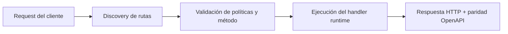

# Curso Desde Cero: Construye una API de Tareas

> Estado verificado al **10 de marzo de 2026**.
> Nota de runtime: FastFN auto-instala dependencias locales por función desde `requirements.txt` / `package.json`; en `fastfn dev --native` necesitas runtimes instalados en host, mientras que `fastfn dev` depende de Docker daemon activo.
¡Bienvenido al curso "Desde Cero" de FastFN! Si es la primera vez que construyes una función, empieza aquí. Este tutorial asume **cero conocimientos previos** de FastFN.

## ¿Qué vamos a construir?

A lo largo de las próximas 4 partes, construiremos una **API de Gestor de Tareas** completa desde cero. Aprenderás a:
1. Crear tu primer endpoint y devolver datos.
2. Manejar rutas dinámicas (como `/tasks/1`) y leer el cuerpo de las peticiones.
3. Gestionar variables de entorno y la configuración de las funciones.
4. Devolver respuestas avanzadas como HTML o cabeceras personalizadas.

## Requisitos Previos

Solo necesitas tener instalado el CLI de FastFN.
- **Modo Portable (recomendado):** Docker Desktop ejecutándose.
- **Modo Nativo:** `fastfn dev --native` (requiere OpenResty + runtimes instalados en el host).

Todo en este tutorial funciona de manera idéntica en ambos modos.

## Ruta de Aprendizaje

1. [Parte 1: Configuración y tu Primera Ruta](./1-setup-y-primera-ruta.md)
2. [Parte 2: Enrutamiento y Datos](./2-enrutamiento-y-datos.md)
3. [Parte 3: Configuración y Secretos](./3-configuracion-y-secretos.md)
4. [Parte 4: Respuestas Avanzadas](./4-respuestas-avanzadas.md)

¡Empecemos!

## Diagrama de Flujo

## Objetivo

Alcance claro, resultado esperado y público al que aplica esta guía.

## Prerrequisitos

- CLI de FastFN disponible
- Dependencias por modo verificadas (Docker para `fastfn dev`, OpenResty+runtimes para `fastfn dev --native`)

## Checklist de Validación

- Los comandos de ejemplo devuelven estados esperados
- Las rutas aparecen en OpenAPI cuando aplica
- Las referencias del final son navegables

## Solución de Problemas

- Si un runtime cae, valida dependencias de host y endpoint de health
- Si faltan rutas, vuelve a ejecutar discovery y revisa layout de carpetas

## Ver también

- [Especificación de Funciones](../../referencia/especificacion-funciones.md)
- [Referencia API HTTP](../../referencia/api-http.md)
- [Checklist Ejecutar y Probar](../../como-hacer/ejecutar-y-probar.md)
