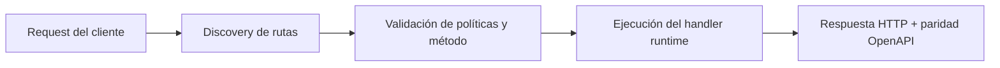

# Tutorial Poliglota (Paso a Paso)


> Estado verificado al **10 de marzo de 2026**.
> Nota de runtime: FastFN auto-instala dependencias locales por función desde `requirements.txt` / `package.json`; en `fastfn dev --native` necesitas runtimes instalados en host, mientras que `fastfn dev` depende de Docker daemon activo.
Este tutorial arma una mini API donde funciones se llaman entre si en distintos runtimes.

Objetivo:

- Mantener un solo modelo de rutas (archivos estilo Next).
- Mezclar Node, Python, PHP y Rust en un mismo flujo.
- Componer todo desde un endpoint final.

Usaremos la carpeta:

- `examples/functions/polyglot-tutorial`

## Paso 0) Levantar el proyecto

```bash
bin/fastfn dev examples/functions
```

## Paso 1) Agregar endpoint inicial en Node

Archivo:

- `polyglot-tutorial/step-1/index.js`

Ruta:

- `GET /polyglot-tutorial/step-1`

Prueba:

```bash
curl -sS http://127.0.0.1:8080/polyglot-tutorial/step-1 | jq .
```

## Paso 2) Agregar endpoint dinamico en Python

Archivo:

- `polyglot-tutorial/step-2/index.py`

Ruta:

- `GET /polyglot-tutorial/step-2?name=<name>`

Prueba:

```bash
curl -sS 'http://127.0.0.1:8080/polyglot-tutorial/step-2?name=Ana' | jq .
```

## Paso 3) Agregar endpoint de score en PHP

Archivo:

- `polyglot-tutorial/step-3/index.php`

Ruta:

- `GET /polyglot-tutorial/step-3?name=<name>`

Prueba:

```bash
curl -sS 'http://127.0.0.1:8080/polyglot-tutorial/step-3?name=Ana' | jq .
```

## Paso 4) Agregar helper en Rust

Archivo:

- `polyglot-tutorial/step-4/index.rs`
- `polyglot-tutorial/step-4/get.status.rs` (alias)

Ruta:

- `GET /polyglot-tutorial/step-4`
- `GET /polyglot-tutorial/step-4/status` (alias)

Prueba:

```bash
curl -sS http://127.0.0.1:8080/polyglot-tutorial/step-4 | jq .
```

## Paso 5) Componer todo con un orquestador Node

Archivo:

- `polyglot-tutorial/step-5/index.js`

Ruta:

- `GET /polyglot-tutorial/step-5?name=<name>`

Que hace:

- Llama a pasos 1, 2, 3 y 4 via HTTP interno (`http://127.0.0.1:8080`).
- Une todas las respuestas en una sola salida.

Prueba:

```bash
curl -sS 'http://127.0.0.1:8080/polyglot-tutorial/step-5?name=Ana' | jq .
```

Forma esperada:

- `step: 5`
- `flow: [ ...cuatro respuestas... ]`
- `summary: "Polyglot pipeline completed for Ana"`

## Por que sirve este patron

- Permite migrar endpoint por endpoint sin cambiar el modelo de gateway.
- Permite dejar handlers rapidos en un runtime y logica pesada en otro.
- Sigue habiendo una sola superficie API y un solo OpenAPI.

## Diagrama de Flujo



## Objetivo

Alcance claro, resultado esperado y público al que aplica esta guía.

## Prerrequisitos

- CLI de FastFN disponible
- Dependencias por modo verificadas (Docker para `fastfn dev`, OpenResty+runtimes para `fastfn dev --native`)

## Checklist de Validación

- Los comandos de ejemplo devuelven estados esperados
- Las rutas aparecen en OpenAPI cuando aplica
- Las referencias del final son navegables

## Solución de Problemas

- Si un runtime cae, valida dependencias de host y endpoint de health
- Si faltan rutas, vuelve a ejecutar discovery y revisa layout de carpetas

## Ver también

- [Especificación de Funciones](../referencia/especificacion-funciones.md)
- [Referencia API HTTP](../referencia/api-http.md)
- [Checklist Ejecutar y Probar](../como-hacer/ejecutar-y-probar.md)
