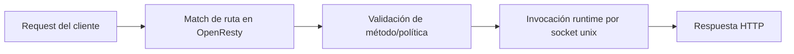

# Inicio Rápido

> Estado verificado al **13 de marzo de 2026**.
> Nota de runtime: FastFN auto-instala dependencias locales por función desde `requirements.txt` / `package.json`; en `fastfn dev --native` necesitas runtimes instalados en host, mientras que `fastfn dev` depende de Docker daemon activo.

## Vista rápida

- Complejidad: Principiante
- Tiempo típico: 10-15 minutos
- Alcance: crear una función, levantar local, llamar endpoint y validar OpenAPI
- Resultado esperado: endpoint `GET /hello` funcionando y docs en `/docs`

## Prerrequisitos

- CLI de FastFN instalado y disponible en `PATH`
- Un modo de ejecución listo:
  - Modo portable: Docker daemon activo
  - Modo native: `openresty` y runtimes (`node`, `python`, etc.) instalados

## 1. Crea tu primera función

```bash
fastfn init hello --template node
```

Esto genera `node/hello/handler.js`.

## 2. Inicia el servidor local

```bash
fastfn dev .
```

## 3. Haz la primera request

```bash
curl -sS 'http://127.0.0.1:8080/hello?name=Mundo'
```

Respuesta esperada:

```json
{
  "status": 200,
  "body": "Hello Mundo"
}
```

## 4. Valida documentación generada

- Swagger UI: [http://127.0.0.1:8080/docs](http://127.0.0.1:8080/docs)
- OpenAPI JSON: [http://127.0.0.1:8080/openapi.json](http://127.0.0.1:8080/openapi.json)

```bash
curl -sS 'http://127.0.0.1:8080/openapi.json' | jq '.paths | has("/hello")'
```

Salida esperada:

```text
true
```


## Flujo de request



## Checklist de validación

- `GET /hello` devuelve HTTP `200`
- `/openapi.json` contiene `/hello`
- `/docs` carga y muestra la ruta

## Solución de problemas

- Runtime caído o `503`: revisa `/_fn/health` y dependencias de host faltantes
- Ruta faltante: confirma layout de carpetas y relanza discovery (`/_fn/reload`)
- `/docs` vacío: valida que no se hayan desactivado toggles de docs/OpenAPI

## Siguientes links

- [Parte 1: setup y primera ruta](./desde-cero/1-setup-y-primera-ruta.md)
- [Enrutamiento y parámetros](./routing.md)
- [Referencia API HTTP](../referencia/api-http.md)
