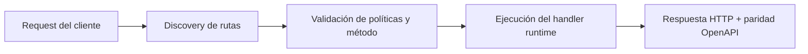

# Enrutamiento


> Estado verificado al **10 de marzo de 2026**.
> Nota de runtime: FastFN auto-instala dependencias locales por función desde `requirements.txt` / `package.json`; en `fastfn dev --native` necesitas runtimes instalados en host, mientras que `fastfn dev` depende de Docker daemon activo.
FastFN usa **enrutamiento basado en archivos**, similar a Next.js.

La estructura de archivos de tu proyecto determina las rutas URL públicas.

## Enrutamiento Básico

| Ruta de Archivo | Ruta URL |
| :--- | :--- |
| `users/index.py` | `/users` |
| `settings/profile.js` | `/settings/profile` |

Ejemplo visual:

```text
functions/
├── users/
│   ├── index.py       # -> GET /users
│   ├── [id].py        # -> GET /users/:id
│   └── _shared.py     # helper privado
└── settings.js        # -> GET /settings
```

## Segmentos Dinámicos

Puedes usar corchetes `[]` para crear parámetros dinámicos de ruta.

| Ruta de Archivo | Ruta URL | Ejemplo |
| :--- | :--- | :--- |
| `users/[id].py` | `/users/:id` | `/users/42` |
| `posts/[category]/[slug].py` | `/posts/:category/:slug` | `/posts/tech/fastfn-intro` |

### Acceder a Parámetros (Inyección Directa)

FastFN inyecta automáticamente los parámetros de ruta como **argumentos directos de la función**. Solo declara el nombre del parámetro en la firma del handler:

=== "Python"
    ```python
    def handler(event, id):
        # Para /users/42, id será "42"
        return {"status": 200, "body": id}
    ```

=== "Node.js"
    ```javascript
    exports.handler = async (event, { id }) => {
        // Para /users/42, id será "42"
        return { status: 200, body: id };
    };
    ```

=== "PHP"
    ```php
    <?php
    function handler($event, $params) {
        // Para /users/42, $params["id"] será "42"
        return ["status" => 200, "body" => $params["id"]];
    }
    ```

=== "Go"
    ```go
    package main

    func handler(event map[string]interface{}) interface{} {
        // Para /users/42, id se fusiona en event
        idStr, _ := event["id"].(string)
        return map[string]interface{}{"status": 200, "body": idStr}
    }
    ```

=== "Rust"
    ```rust
    use serde_json::{json, Value};

    pub fn handler(event: Value) -> Value {
        // Para /users/42, id se fusiona en event
        let user_id = event["id"].as_str().unwrap_or("");
        json!({"status": 200, "body": user_id})
    }
    ```

=== "Lua"
    ```lua
    local function handler(event, params)
        -- Para /users/42, params.id será "42"
        return { status = 200, body = params.id }
    end

    return handler
    ```

!!! info "Cómo funciona la inyección por runtime"
    | Runtime | Mecanismo | Firma |
    |---------|-----------|-------|
    | Python | `inspect.signature` kwargs | `def handler(event, id):` |
    | Node.js | Segundo arg cuando `handler.length > 1` | `async (event, { id }) =>` |
    | PHP | `ReflectionFunction` segundo arg | `function handler($event, $params)` |
    | Lua | Siempre pasa segundo arg | `function handler(event, params)` |
    | Go | Params fusionados en event map | `event["id"].(string)` |
    | Rust | Params fusionados en event value | `event["id"].as_str()` |

!!! tip "Compatible con código existente"
    Las firmas `handler(event)` existentes siguen funcionando sin cambios. Los params solo se inyectan cuando el handler los declara.

### Múltiples Parámetros

Para segmentos anidados como `posts/[category]/[slug]/get.py`:

=== "Python"
    ```python
    def handler(event, category, slug):
        return {"status": 200, "body": f"{category}/{slug}"}
    ```

=== "Node.js"
    ```javascript
    exports.handler = async (event, { category, slug }) => ({
      status: 200, body: `${category}/${slug}`,
    });
    ```

### Wildcard Catch-All

Para `files/[...path]/get.py`, se captura todo el path restante:

=== "Python"
    ```python
    def handler(event, path):
        # /files/docs/2024/report.pdf -> path = "docs/2024/report.pdf"
        segments = path.split("/") if path else []
        return {"status": 200, "body": {"path": path, "depth": len(segments)}}
    ```

=== "Node.js"
    ```javascript
    exports.handler = async (event, { path }) => {
      const segments = path ? path.split("/") : [];
      return { status: 200, body: JSON.stringify({ path, depth: segments.length }) };
    };
    ```

## Precedencia de Rutas

Si tienes rutas superpuestas, FastFN sigue una precedencia estricta:

1. **Rutas estáticas**: `users/settings.py` (más específica)
2. **Rutas dinámicas**: `users/[id].py` (general)
3. **Rutas catch-all**: `users/[...slug].py` (más general)

FastFN aplica un orden determinista de "la más específica gana", así que una catch-all no puede capturar una ruta más específica.

## Helpers privados y carpetas mixtas

Puedes importar módulos locales sin publicarlos como endpoints.

- En un pure file tree, prefija helpers privados con `_`:
  - `users/_shared.py`
  - `users/_shared.js`
- En una carpeta single-entry, los módulos hermanos quedan privados por defecto:
  - `whatsapp/handler.js` es la función pública
  - `whatsapp/core.js` es implementación privada
- Las subcarpetas bajo una función single-entry todavía pueden exponer rutas explícitas:
  - `whatsapp/admin/index.js` -> `/whatsapp/admin`
  - `whatsapp/admin/get.health.js` -> `GET /whatsapp/admin/health`
  - `whatsapp/admin/helpers.js` sigue privado

Así obtienes un directorio estilo Lambda sin perder subrutas estilo Next.js.

## Métodos HTTP

Por defecto, una ruta es `GET` salvo que configures otro método.

Para restringir métodos o manejarlos de forma distinta:

### Opción 1: lógica dentro del handler

=== "Python"
    ```python
    def handler(event):
        method = event.get("method")
        if method == "POST":
            return create_item(event)
        elif method == "GET":
            return get_item(event)
        return {"status": 405, "body": "Method not allowed"}
    ```

=== "Node.js"
    ```javascript
    exports.handler = async (event) => {
      if (event.method === "POST") return createItem(event);
      if (event.method === "GET") return getItem(event);
      return { status: 405, body: "Method not allowed" };
    };
    ```

=== "PHP"
    ```php
    <?php
    function handler($event) {
        if ($event["method"] === "POST") return create_item($event);
        if ($event["method"] === "GET") return get_item($event);
        return ["status" => 405, "body" => "Method not allowed"];
    }
    ```

=== "Go"
    ```go
    package main

    func handler(event map[string]interface{}) interface{} {
        method, _ := event["method"].(string)
        switch method {
        case "POST":
            return createItem(event)
        case "GET":
            return getItem(event)
        }
        return map[string]interface{}{"status": 405, "body": "Method not allowed"}
    }
    ```

=== "Rust"
    ```rust
    use serde_json::{json, Value};

    pub fn handler(event: Value) -> Value {
        match event["method"].as_str().unwrap_or("") {
            "POST" => create_item(&event),
            "GET"  => get_item(&event),
            _      => json!({"status": 405, "body": "Method not allowed"}),
        }
    }
    ```

=== "Lua"
    ```lua
    local function handler(event)
        if event.method == "POST" then return create_item(event) end
        if event.method == "GET"  then return get_item(event)    end
        return { status = 405, body = "Method not allowed" }
    end

    return handler
    ```

### Opción 2: `fn.config.json`

Agrega un archivo de configuración junto al handler:

`users/[id]/fn.config.json`:
```json
{
  "invoke": {
    "methods": ["GET"]
  }
}
```

Ahora `POST /users/42` devolverá automáticamente `405 Method Not Allowed`.

### Opción 3: Archivos por Método

En lugar de ramificar por `event.method` dentro de un handler, crea archivos separados:

```text
users/
  get.py       # maneja GET /users
  post.py      # maneja POST /users
  [id]/
    get.py     # maneja GET /users/:id
    put.py     # maneja PUT /users/:id
    delete.py  # maneja DELETE /users/:id
```

Cada archivo maneja un solo método. FastFN infiere el método del prefijo del nombre de archivo.
Consulta [Enrutamiento Zero-Config](../como-hacer/zero-config-routing.md) para los detalles completos.

[Siguiente: Recetas Operativas :arrow_right:](../como-hacer/recetas-operativas.md)

## Diagrama de Flujo



## Objetivo

Alcance claro, resultado esperado y público al que aplica esta guía.

## Prerrequisitos

- CLI de FastFN disponible
- Dependencias por modo verificadas (Docker para `fastfn dev`, OpenResty+runtimes para `fastfn dev --native`)

## Checklist de Validación

- Los comandos de ejemplo devuelven estados esperados
- Las rutas aparecen en OpenAPI cuando aplica
- Las referencias del final son navegables

## Solución de Problemas

- Si un runtime cae, valida dependencias de host y endpoint de health
- Si faltan rutas, vuelve a ejecutar discovery y revisa layout de carpetas

## Ver también

- [Especificación de Funciones](../referencia/especificacion-funciones.md)
- [Referencia API HTTP](../referencia/api-http.md)
- [Checklist Ejecutar y Probar](../como-hacer/ejecutar-y-probar.md)
