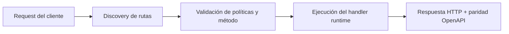

# Tu primera función (CLI)


> Estado verificado al **10 de marzo de 2026**.
> Nota de runtime: FastFN auto-instala dependencias locales por función desde `requirements.txt` / `package.json`; en `fastfn dev --native` necesitas runtimes instalados en host, mientras que `fastfn dev` depende de Docker daemon activo.
En este tutorial vas a crear una función simple y ejecutarla localmente usando el layout neutral que recomienda esta doc: `functions/<nombre>/...`.

Runtimes estables hoy: `python`, `node`, `php`, `lua`. Runtimes experimentales (opt-in): `rust`, `go`.

## 1) Crear el directorio `functions/` (recomendado)

En la raíz de tu proyecto:

```bash
mkdir -p functions
```

Opcional: si creas un `fastfn.json` en el root del repo, puedes ejecutar `fastfn dev` sin pasar directorio:

```json title="fastfn.json"
{
  "functions-dir": "functions"
}
```

## 2) Generar una función con `fastfn init`

Puedes escribir la función directamente dentro de `functions/mi-perfil/`. Si quieres código inicial, `fastfn init` sigue siendo útil, pero el scaffold actual se crea agrupado por runtime (`./python/mi-perfil/`, `./node/mi-perfil/`, etc.), mientras que esta documentación recomienda layouts neutrales para proyectos nuevos.

Ejemplo (Python):

```bash
fastfn init mi-perfil -t python
```

Para el resto de este tutorial, asume que tu función vive en `functions/mi-perfil/` con un entrypoint como `handler.js`, `handler.py`, `handler.php` o `handler.rs`.

Puedes repetirlo con otros runtimes:

```bash
fastfn init mi-perfil-node -t node
fastfn init mi-perfil-php -t php
fastfn init mi-perfil-lua -t lua
```

## 3) Ejecutar el servidor de desarrollo

```bash
fastfn dev functions
```

Luego abre:

- `GET /docs` (Swagger UI)
- `GET /openapi.json` (OpenAPI de funciones públicas)

## 4) Probar tu endpoint

```bash
curl -sS 'http://127.0.0.1:8080/mi-perfil?name=Ada&role=admin' \
  -H 'Authorization: Bearer demo-token'
```

## 5) Ajustar política (`fn.config.json`)

Edita `functions/mi-perfil/fn.config.json` para cambiar métodos, timeout, límites y ejemplos:

```json title="functions/mi-perfil/fn.config.json"
{
  "timeout_ms": 1500,
  "max_concurrency": 5,
  "max_body_bytes": 262144,
  "invoke": {
    "methods": ["GET", "POST"],
    "summary": "Retorna un payload de perfil",
    "query": {"name": "Ada", "role": "admin"},
    "body": ""
  }
}
```

FastFN aplica cambios en caliente. Si quieres forzar un rescan manual:

```bash
curl -sS -X POST 'http://127.0.0.1:8080/_fn/reload'
```

## 6) Ejecutar en modo producción (nativo)

Para correr con defaults de producción (sin hot reload):

```bash
FN_HOST_PORT=8080 \
FN_UI_ENABLED=0 \
FN_CONSOLE_API_ENABLED=0 \
FN_CONSOLE_WRITE_ENABLED=0 \
FN_PUBLIC_BASE_URL=https://api.midominio.com \
fastfn run --native functions
```

Validación rápida:

```bash
curl -sS 'http://127.0.0.1:8080/mi-perfil?name=Ada'
curl -sS 'http://127.0.0.1:8080/openapi.json'
```

## 7) (Opcional) SDK de FastFN en Node

Si quieres helpers de request/response en handlers Node:

```bash
npm install ./sdk/js
```

Ejemplo de handler:

```js
const { Request, toResponse } = require('@fastfn/runtime');

exports.handler = async (event) => {
  const req = new Request(event);
  return toResponse({
    ok: true,
    method: req.method,
    path: req.path,
  });
};
```

Ejemplo de cliente consumiendo la API:

```js
const baseUrl = process.env.FASTFN_BASE_URL || 'http://127.0.0.1:8080';

async function main() {
  const res = await fetch(`${baseUrl}/mi-perfil?name=Ada`);
  const body = await res.json();
  console.log({ status: res.status, body });
}

main().catch(console.error);
```

## Diagrama de Flujo



## Objetivo

Alcance claro, resultado esperado y público al que aplica esta guía.

## Prerrequisitos

- CLI de FastFN disponible
- Dependencias por modo verificadas (Docker para `fastfn dev`, OpenResty+runtimes para `fastfn dev --native`)

## Checklist de Validación

- Los comandos de ejemplo devuelven estados esperados
- Las rutas aparecen en OpenAPI cuando aplica
- Las referencias del final son navegables

## Solución de Problemas

- Si un runtime cae, valida dependencias de host y endpoint de health
- Si faltan rutas, vuelve a ejecutar discovery y revisa layout de carpetas

## Ver también

- [Especificación de Funciones](../referencia/especificacion-funciones.md)
- [Referencia API HTTP](../referencia/api-http.md)
- [Checklist Ejecutar y Probar](../como-hacer/ejecutar-y-probar.md)
