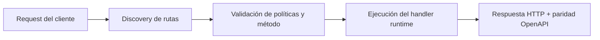

# Versionado y Rollout


> Estado verificado al **10 de marzo de 2026**.
> Nota de runtime: FastFN auto-instala dependencias locales por función desde `requirements.txt` / `package.json`; en `fastfn dev --native` necesitas runtimes instalados en host, mientras que `fastfn dev` depende de Docker daemon activo.
FastFN soporta versiones lado-a-lado (por ejemplo `v2`) para poder publicar cambios sin romper a los clientes existentes.

## 1) Estructura de carpetas (runtime split)

El versionado se representa con una subcarpeta dentro de la funcion:

```text
functions/
  python/
    hello/
      app.py      # version default
      v2/
        app.py    # version v2
```

## 2) Ejemplo de codigo

Default (`functions/python/hello/app.py`):

```python
def main(req):
    name = (req.get("query") or {}).get("name", "World")
    return {"message": f"Hola desde V1, {name}"}
```

Version `v2` (`functions/python/hello/v2/app.py`):

```python
def main(req):
    name = (req.get("query") or {}).get("name", "World")
    return {"status": "success", "data": {"greeting": f"Hola desde V2, {name}"}}
```

## 3) Llamar default vs version

Default (si existe `app.py` en la raiz):

```bash
curl -sS 'http://127.0.0.1:8080/hello?name=World'
```

Version:

```bash
curl -sS 'http://127.0.0.1:8080/hello@v2?name=World'
```

## 4) Patron de rollout

1. Publica la carpeta `v2/`.
2. Prueba con `GET /hello@v2`.
3. Migra clientes gradualmente.
4. Elimina la version vieja cuando el trafico llegue a cero.

[Siguiente: Auth y Secretos](./auth-y-secretos.md){ .md-button .md-button--primary }

## Diagrama de Flujo



## Objetivo

Alcance claro, resultado esperado y público al que aplica esta guía.

## Prerrequisitos

- CLI de FastFN disponible
- Dependencias por modo verificadas (Docker para `fastfn dev`, OpenResty+runtimes para `fastfn dev --native`)

## Checklist de Validación

- Los comandos de ejemplo devuelven estados esperados
- Las rutas aparecen en OpenAPI cuando aplica
- Las referencias del final son navegables

## Solución de Problemas

- Si un runtime cae, valida dependencias de host y endpoint de health
- Si faltan rutas, vuelve a ejecutar discovery y revisa layout de carpetas

## Ver también

- [Especificación de Funciones](../referencia/especificacion-funciones.md)
- [Referencia API HTTP](../referencia/api-http.md)
- [Checklist Ejecutar y Probar](../como-hacer/ejecutar-y-probar.md)
