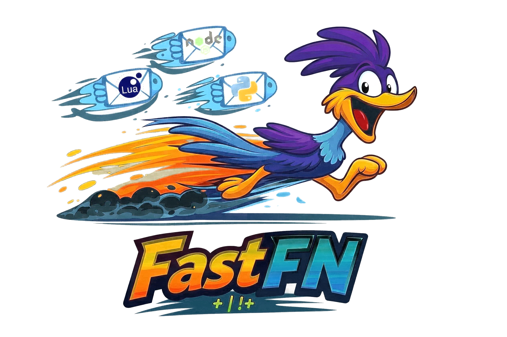

---
hide:
  - toc
---

<style>
.md-content .md-typeset h1 { display: none; }
</style>

<p align="center">
  
</p>
<p align="center">
    <em>Self-hosted FaaS platform, high performance, easy to learn, fast to code</em>
</p>
<p align="center">
<a href="https://github.com/misaelzapata/fastfn" target="_blank">
    
</a>
<a href="https://github.com/misaelzapata/fastfn/actions/workflows/docs.yml" target="_blank">
    
</a>
<a href="https://codecov.io/gh/misaelzapata/fastfn" target="_blank">
    
</a>
</p>

<hr />
<p><strong>Documentation</strong>: <a href="https://fastfn.dev/en/" target="_blank">https://fastfn.dev/en/</a></p>
<p><strong>Source Code</strong>: <a href="https://github.com/misaelzapata/fastfn" target="_blank">https://github.com/misaelzapata/fastfn</a></p>
<hr />

<p>FastFN is a CLI-friendly, self-hosted FaaS server for building file-routed APIs, shipping SPA + API stacks, and keeping the whole project easy to run locally or on a VM.</p>

<p>The key features are:</p>
<ul>
<li><strong>Fast to code</strong>: Drop a file, get an endpoint, and keep the route tree close to the code that serves it.</li>
<li><strong>Automatic Docs</strong>: Interactive API documentation (Swagger UI) generated automatically from your code.</li>
<li><strong>Polyglot Power</strong>: Use the best tool for the job. Python, Node, PHP, Lua, Rust, or Go in one project.</li>
<li><strong>SPA + API</strong>: Mount a configurable <code>public/</code> or <code>dist/</code> folder at <code>/</code> and keep simple API handlers beside it.</li>
</ul>

<p align="center">
  
</p>

<p align="center">
  <a href="./en/tutorial/first-steps.md"><strong>English Quick Start</strong></a>
  &bull;
  <a href="./en/tutorial/spa-and-api-together.md"><strong>SPA + API</strong></a>
  &bull;
  <a href="./en/how-to/run-as-a-linux-service.md"><strong>Linux Service</strong></a>
  &bull;
  <a href="./en/index.md"><strong>English Docs</strong></a>
  &bull;
  <a href="./es/index.md"><strong>Docs en Español</strong></a>
</p>

## Start in 60 seconds

### 1. Drop a file, get an endpoint

Create a file named `hello.js` (or `.py`, `.php`, `.rs`):

=== "Node.js"
    ```js
    // hello.js
    exports.handler = async () => "Hello World";
    ```

=== "Python"
    ```python
    # hello.py
    def handler(event):
        return {"hello": "world"}
    ```

=== "PHP"
    ```php
    <?php
    function handler($event) {
        return "Hello World";
    }
    ```

=== "Lua"
    ```lua
    function handler(event)
      return { hello = "world" }
    end
    ```

=== "Go"
    ```go
    package main

    func handler(event map[string]interface{}) map[string]interface{} {
        return map[string]interface{}{
            "status": 200,
            "body": "Hello World",
        }
    }
    ```

=== "Rust"
    ```rust
    use serde_json::{json, Value};

    pub fn handler(_event: Value) -> Value {
        json!({
            "status": 200,
            "body": "Hello World"
        })
    }
    ```

### 2. Run the server

```bash
fastfn dev
```

### 3. Call your API

<p align="center">
  
</p>

No `serverless.yml`. No framework boilerplate. File routes are discovered automatically.

## Where to go next

- [English Quick Start](./en/tutorial/first-steps.md)
- [English docs home](./en/index.md)
- [Spanish docs home](./es/index.md)

<div class="grid cards" markdown>

-   **Documentation**
    
    Start learning FastFN step-by-step.
    
    [Read the Docs](./en/index.md)

-   **New Article**
    
    See the Cloudflare-style public assets model and the three runnable demos.
    
    [Cloudflare-Style Public Assets](./en/articles/cloudflare-style-public-assets.md)

-   **SPA + API**

    Serve a browser app and a small API from the same FastFN project.

    [Serve a SPA and API Together](./en/tutorial/spa-and-api-together.md)

-   **Linux Service**

    Run FastFN behind systemd with simple TLS guidance in front.

    [Run FastFN as a Linux Service](./en/how-to/run-as-a-linux-service.md)

</div>
