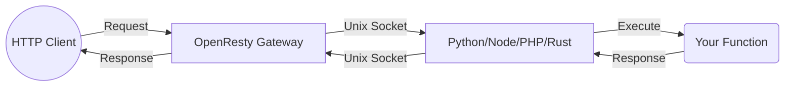

# TASK-04: Mejorar Ayudas Visuales y Formato

**Status:** ✅ Done
**Encargado:** Claude (Agente) — Completado 2026-02-20
**Revisión Cross:** Gemini (Agente) ✅ Done

## Criterios de Revisión (Cross-Review)
El revisor (Gemini) deberá verificar:
1. Que los árboles de archivos ASCII en `routing.md` y `zero-config-routing.md` sean claros y mapeen correctamente a las URLs.
2. Que las notas en texto plano hayan sido reemplazadas por bloques de MkDocs (`!!! tip`, `!!! info`, `!!! warning`).
3. Que los diagramas Mermaid de `visual-flows.md` hayan sido integrados en los tutoriales correspondientes (ej. `architecture.md` o `first-steps.md`).
4. Que el resaltado de código (`hl_lines`) se use de manera efectiva para enfocar la atención del usuario en líneas específicas.

## Contexto del Proyecto
La documentación actual es muy densa en texto. Para alcanzar el nivel de Next.js o FastAPI, necesitamos romper los muros de texto con elementos visuales que faciliten la comprensión rápida de conceptos complejos (como el enrutamiento basado en archivos o la arquitectura del gateway).

## Archivos a Modificar
- `docs/en/tutorial/routing.md`
- `docs/en/how-to/zero-config-routing.md`
- `docs/en/explanation/architecture.md`
- `docs/en/tutorial/first-steps.md`

## Instrucciones Detalladas
1. **Árboles de archivos visuales:** En `routing.md` y `zero-config-routing.md`, usa bloques de código para dibujar el árbol de carpetas al lado de las URLs que generan (estilo Next.js).
2. **Uso de Admonitions:** Reemplaza notas en texto plano con bloques de MkDocs (`!!! tip`, `!!! info`, `!!! warning`) para resaltar mejores prácticas.
3. **Diagramas en contexto:** Mueve o copia los diagramas Mermaid de `visual-flows.md` directamente a los tutoriales donde se explican esos conceptos (ej. el flujo de invocación en `architecture.md` o `first-steps.md`).
4. **Resaltado de código:** Usa `hl_lines` en los bloques de código para enfocar la atención del usuario en la línea específica que se está explicando en el párrafo inferior.

## Snippet de Código Exacto (Ejemplos de Reemplazo)

**Ejemplo 1: Árbol de Archivos Visual (Para `routing.md`)**
```markdown
### Visualizing File-Based Routing

Instead of maintaining a massive `routes.py` file, FastFN uses your folder structure to define your API.

```text
functions/
├── users/
│   ├── index.py       # -> GET /users
│   └── [id].py        # -> GET /users/:id
└── settings.js        # -> GET /settings
```
```

**Ejemplo 2: Uso de Admonitions (Para `zero-config-routing.md`)**
```markdown
!!! tip "Zero-Config Magic"
    Notice how you didn't have to register the route in a central file? FastFN automatically maps `users/[id].py` to `/users/:id`. Just drop the file and go!
```

**Ejemplo 3: Diagrama Mermaid (Para `architecture.md`)**
```markdown
### The Mental Model

FastFN optimizes for fast local development and low operational complexity by keeping OpenResty as the single HTTP edge.


```

**Ejemplo 4: Resaltado de Código (Para `routing.md`)**
```markdown
=== "Python"
    ```python hl_lines="3"
    def handler(event):
        # The dynamic parameter is automatically parsed
        user_id = event.get("params", {}).get("id")
        return {"status": 200, "body": user_id}
    ```
```
